.. role:: envvar(literal)
.. role:: command(literal)
.. role:: file(literal)
.. _geometry:

===================
CAID Python Package
===================

Tutorial
========

Predefined geometries
*********************

square
^^^^^^

You can create a square by importing the square function

.. literalinclude:: ../../examples/predefined_geometries_2d.py
  :lines: 4-9

The resulting plot is

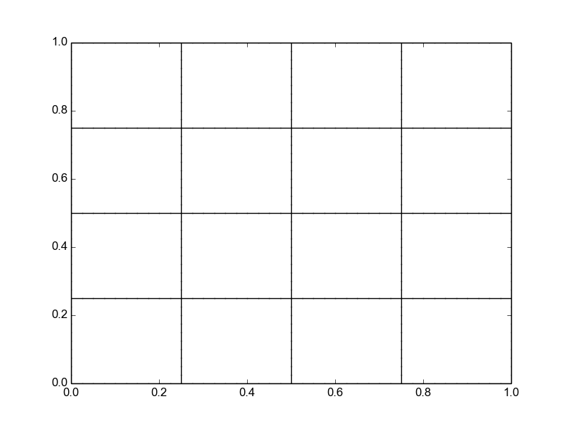

circle
^^^^^^

You can create a circle by importing the circle function

.. literalinclude:: ../../examples/predefined_geometries_2d.py
  :lines: 13-18

The resulting plot is

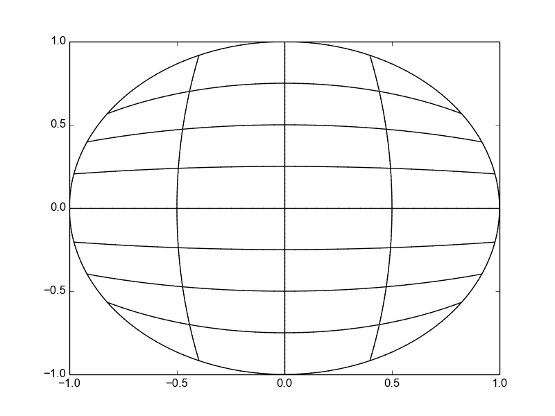

quart_circle
^^^^^^^^^^^^

You can create a quarter of circle by importing the quart_circle function

.. literalinclude:: ../../examples/predefined_geometries_2d.py
  :lines: 22-27

The resulting plot is

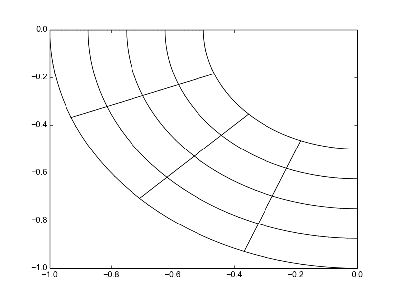

annulus
^^^^^^^

You can create a annulus by importing the annulus function

.. literalinclude:: ../../examples/predefined_geometries_2d.py
  :lines: 31-36

The resulting plot is

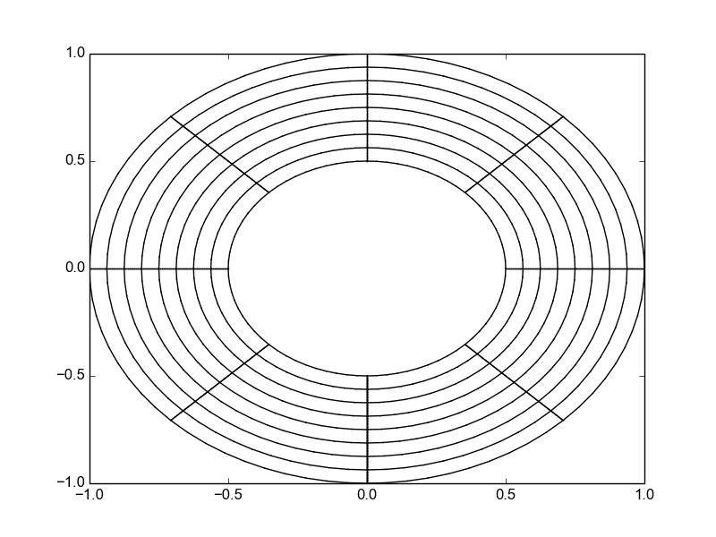

circle 5 patchs
^^^^^^^^^^^^^^^

You can create a 5 patchs circle by importing the circle_5mp function

.. literalinclude:: ../../examples/predefined_geometries_2d.py
  :lines: 40-45

The resulting plot is

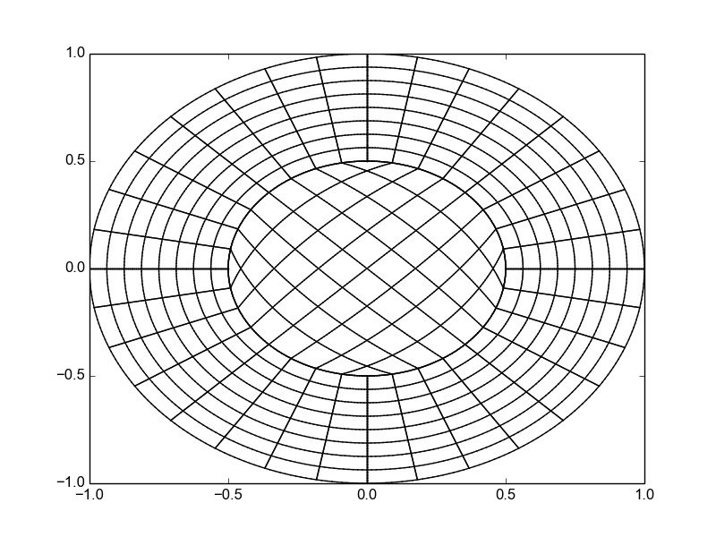

Geometry Transformations
************************

The nice thing about Bézier and B-Spline surfaces, is that any affine transformation on the geometry can be done on its control points.

Translation
^^^^^^^^^^^

Let's start from a unit square and translate it by a displacement vector :math:`(1,2)`. This can be done easily by

.. literalinclude:: ../../examples/transformations_2d.py
  :lines: 5-12

The result is the following plot

.. image:: include/geometry/transformations_2d_translate.png        
   :width: 8cm
   :height: 8cm

Rotation
^^^^^^^^

Let's take a unit square and rotate it with and angle of :math:`\frac{\pi}{4}`

.. literalinclude:: ../../examples/transformations_2d.py
  :lines: 29-35

The result is the following plot

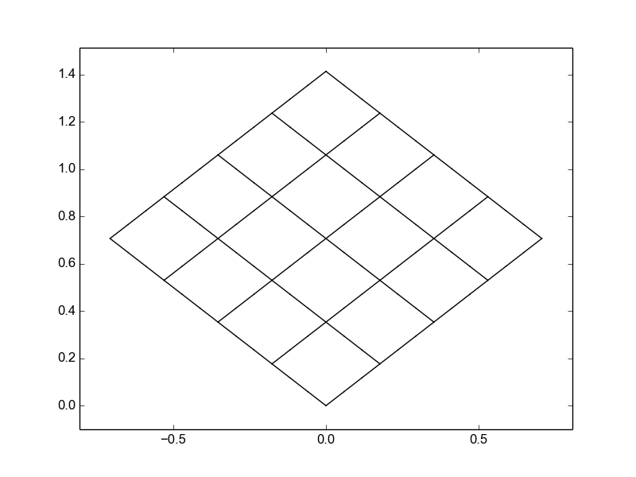

Scaling
^^^^^^^

In this example, we show how to construct en ellipse starting from a unit circle. We take a unit circle and scale it with :math:`(2,4)` in each direction

.. literalinclude:: ../../examples/transformations_2d.py
  :lines: 51-58

The result is the following plot

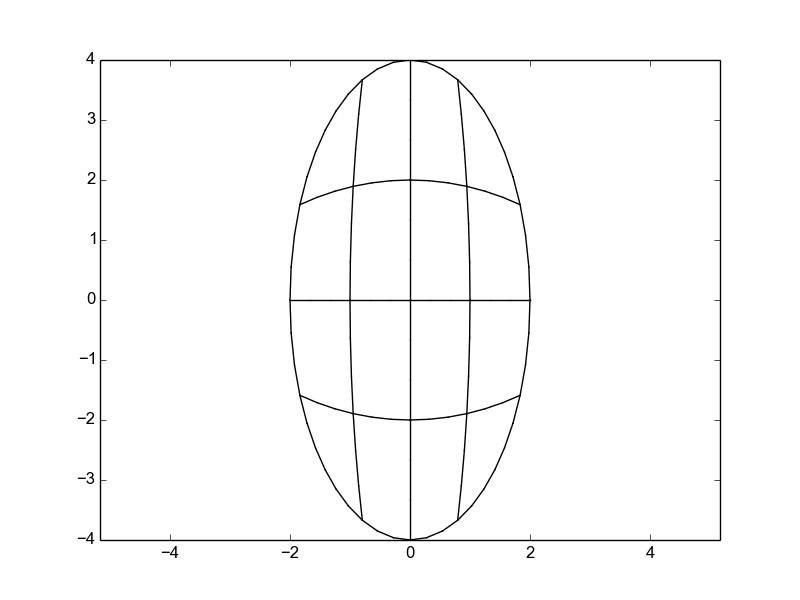

Dive into CAID
==============

**CAID** is based on a two level objects. The first one is describing a single patch (subdomain) which is the **cad_nurbs** object for the quadrangular case. The second one (level 0) describes the global geometry as a collection of level one objects: **cad_geometry**

cad_nurbs
*********

The **cad_nurbs** object is an extension of the **NURBS** of **IGAKIT** but implements some additional informations that are needed for the multi-patchs case, like:

* **orientation**: needed for *Neumann* boundary conditions

* **rational**: *True* if we use the weights. Default value : *False*

The following script creates a curve, inserts one knot and raises the spline degree by one:

.. literalinclude:: ../../examples/curve_ex1.py

The original curve is 

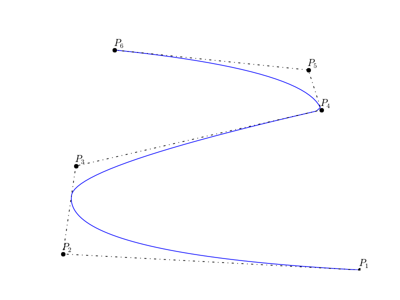

After inserting a knot and elevating the spline degree, we get

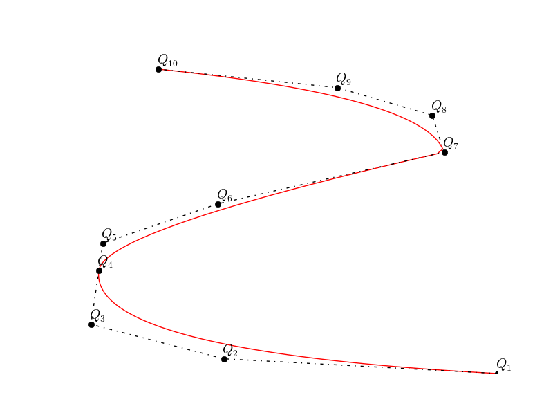

cad_geometry
************

In this section, we show some useful functions of the **cad_geometry** object.

Polar Extrude
^^^^^^^^^^^^^

Let's start with a 2D curve as given by the following plot

.. literalinclude:: ../../examples/polar_extrude_ex1.py
  :lines: 9-33

The result is the following plot

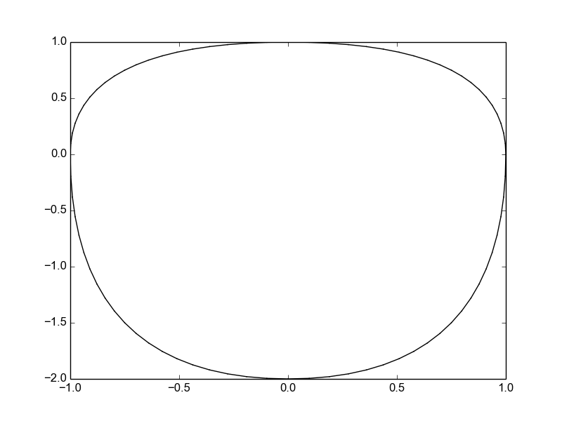

Now we can apply the polar extrude algorithm to fill in the domain

.. literalinclude:: ../../examples/polar_extrude_ex1.py
  :lines: 35-44

The result is the following plot, which is singular at the center.

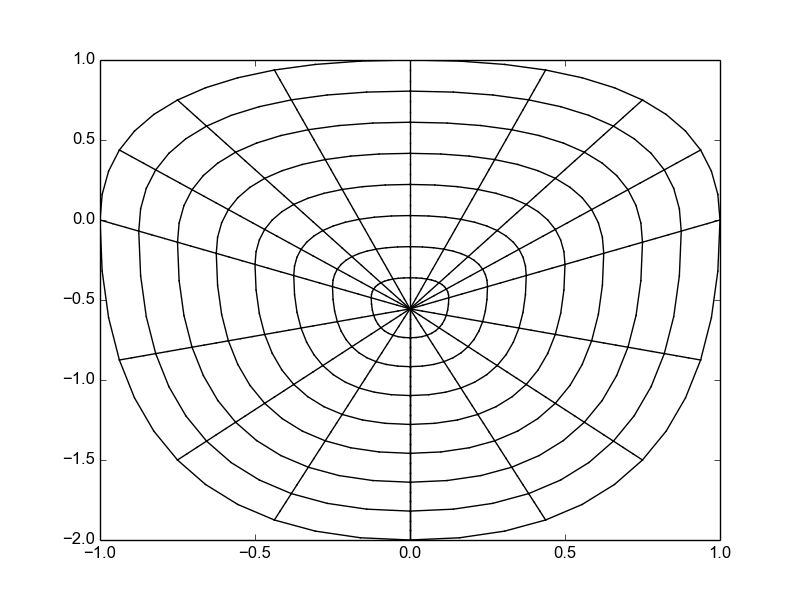

The user can also specify a center, or give a scaling factor, to scale the boundary with respect to the center. The following script shows how to do this

.. literalinclude:: ../../examples/polar_extrude_ex1.py
  :lines: 46-55

The result is the following plot

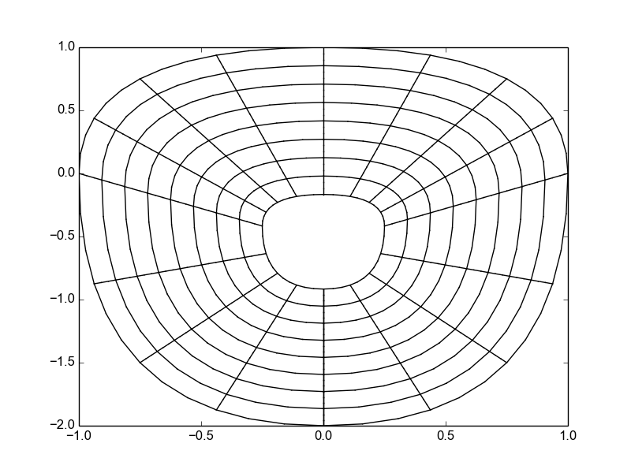

Now, what we want is to fill in the hole and avoid the singular map. Let's first get some information about the boundary, specially, we need to know what is the face id of the internal face. This can be done by calling 

.. literalinclude:: ../../examples/polar_extrude_ex1.py
  :lines: 57-63

The result is the following plot

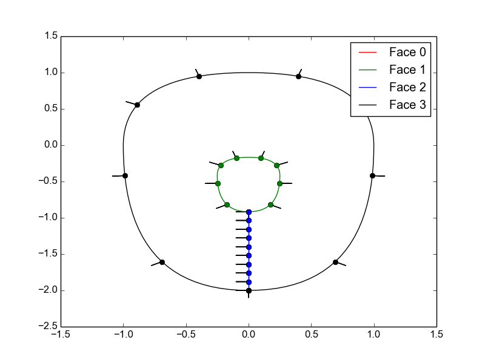

Therefor, we use the face id, by calling the to5patchs functions as the following

.. literalinclude:: ../../examples/polar_extrude_ex1.py
  :lines: 65-74

The result is the following plot

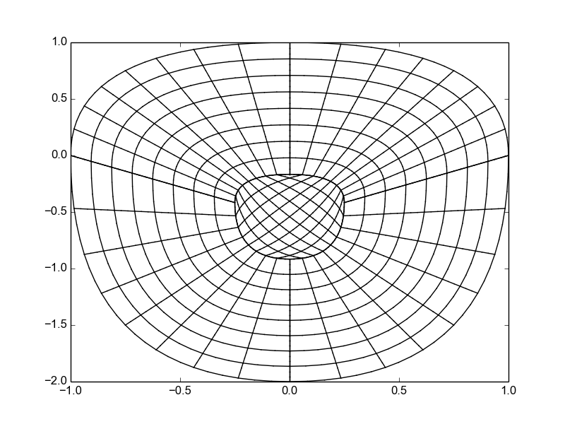

Multi-Patchs geometries
^^^^^^^^^^^^^^^^^^^^^^^

In many applications, we need to use a multi-patch description. This means that the physical domain will be splitted into sub-domains, each of them is an image of a square in *2D* (line in *1D*, cube in *3D*). Therefore, we need to provide the connectivity of these macro-elements. For this purpose, we have added the *merge* function that does this (almost) automatically. Next we give two examples of constructing a *4* patchs description of the square and a *5* patchs description of the circle.

.. code-block:: python 

    # ... Import the square domain -A-
    geo_1 = square(n=[nx,ny],p=[px,py])

    # ... Import the square domain -B-
    geo_2 = square(n=[nx,ny],p=[px,py])
    geo_2[0].translate(1.0, axis=0)

    # ... Import the square domain -C-
    geo_3 = square(n=[nx,ny],p=[px,py])
    geo_3[0].translate(1.0, axis=1)

    # ... Import the square domain -D-
    geo_4 = square(n=[nx,ny],p=[px,py])
    geo_4[0].translate(1.0, axis=0)
    geo_4[0].translate(1.0, axis=1)

    # ... merging geometries
    geo_12 = geo_1.merge(geo_2)
    geo_34 = geo_3.merge(geo_4)
    geo = geo_12.merge(geo_34)

    # ... scaling to the unit square
    for i in range(0, geo.npatchs):
        geo[i].scale(0.5, axis=0)
        geo[i].scale(0.5, axis=1)

which gives the following subdivision

.. image:: include/geometry/square_4mp.png        
   :width: 8cm
   :height: 8cm

An interesting example is the construction of a circle domain using *5* patchs, which can be done as the following

.. code-block:: python 

    # ... Import the quart_circle domain -A-
    geo_1 = quart_circle(n=[nx,ny],p=[px,py])
    geo_1[0].transpose()

    # ... Import the quart_circle domain -B-
    geo_2 = quart_circle(n=[nx,ny],p=[px,py])
    geo_2[0].rotate(0.5*np.pi)
    geo_2[0].transpose()

    # ... Import the quart_circle domain -C- 
    geo_3 = quart_circle(n=[nx,ny],p=[px,py])
    geo_3[0].rotate(np.pi)
    geo_3[0].reverse(0)

    # ... Import the quart_circle domain -D-
    geo_4 = quart_circle(n=[nx,ny],p=[px,py])
    geo_4[0].rotate(1.5*np.pi)
    geo_4[0].reverse(0)

    # ... Import the circle domain -E-
    geo_5 = circle(radius=0.5,n=[nx,ny],p=[px,py])
    geo_5[0].rotate(0.25*np.pi)
    geo_5[0].rotate(0.5*np.pi)

    # ... merging geometries
    geo_12   = geo_1.merge(geo_2)
    geo_34   = geo_3.merge(geo_4)
    geo_1234 = geo_12.merge(geo_34)
    geo      = geo_1234.merge(geo_5)

which gives the following subdivision

.. image:: include/geometry/circle_5mp.png        
   :width: 8cm
   :height: 8cm

.. note:: Sometimes you need to reverse the parametrization of the domain in order to merge it with another one. In the previous example, we see that we had to reverse the parametrization for the quart circles **C** and **D**. Otherwise, **pigasus** will not reconize the duplicated faces. In this case, you will get a message informing you that **pigasus** found 2 faces that can match if you reverse the parametrization of one of them.

The resulting mesh for the previous geometry is 

.. image:: include/geometry/circle_5mp_mesh.png        
   :width: 8cm
   :height: 8cm

We can check the **Jacobian** of the corresponding mappings by typing

.. code-block:: python

   import matplotlib.pyplot as plt
   geo.plotJacobians(MeshResolution=50)
   plt.show()

which gives the following plot

.. image:: include/geometry/circle_5mp_jacobian.png
   :width: 9cm
   :height: 9cm

About the **XML** format
^^^^^^^^^^^^^^^^^^^^^^^^

Many formats exist to describe B-splines and NURBS. We prefered to developp our own format so that we can include some additional data needed for the Finite Element solver.

In some cases, the user may want to add specific informations about one single *B-spline/NURBS* (patch). This can be achieved using *XML* attributs. For instance, any *cad_object* object offers the *set_attribut* function. Here are some examples:

.. code-block:: python

   C = [[0, 1], [1, 1], [1, 0]] # 3x2 grid of 2D control points
   w = [1, np.sqrt(2)/2, 1]     # rational weigths
   U = [0,0,0, 1,1,1]           # knot vector
   crv = cad_nurbs([U], C, weights=w)   
   crv.set_attribut("name", "arc-circle")
   crv.set_attribut("color", "#7A3030")
   crv.set_attribut("type", "nurbs")

For the moment only three attributs exist:

* **name** : sets a name for the patch,

* **color** : sets a color for the patch,

* **type** : the type of the patch. Possible values are **spline**, **nurbs** and **gradiant**. When not specified, this means that the patch is either a *spline* or a *nurbs*.

.. include:: io_driver.rst

.. Local Variables:
.. mode: rst
.. End:
