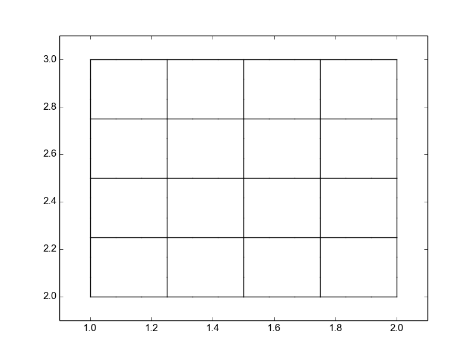

.. role:: envvar(literal)
.. role:: command(literal)
.. role:: file(literal)
.. _geometry:

===================
CAID Python Package
===================

Tutorial
========

Predefined geometries
*********************

square
^^^^^^

You can create a square by importing the square function

.. literalinclude:: ../../examples/predefined_geometries_2d.py
  :lines: 4-9

The resulting plot is

.. image:: include/geometry/predefined_geometries_2d_square.png        
   :width: 8cm
   :height: 8cm

circle
^^^^^^

You can create a circle by importing the circle function

.. literalinclude:: ../../examples/predefined_geometries_2d.py
  :lines: 13-18

The resulting plot is

.. image:: include/geometry/predefined_geometries_2d_circle.png        
   :width: 8cm
   :height: 8cm

quart_circle
^^^^^^^^^^^^

You can create a quarter of circle by importing the quart_circle function

.. literalinclude:: ../../examples/predefined_geometries_2d.py
  :lines: 22-27

The resulting plot is

.. image:: include/geometry/predefined_geometries_2d_quart_circle.png        
   :width: 8cm
   :height: 8cm

annulus
^^^^^^^

You can create a annulus by importing the annulus function

.. literalinclude:: ../../examples/predefined_geometries_2d.py
  :lines: 31-36

The resulting plot is

.. image:: include/geometry/predefined_geometries_2d_annulus.png        
   :width: 8cm
   :height: 8cm

circle 5 patchs
^^^^^^^^^^^^^^^

You can create a 5 patchs circle by importing the circle_5mp function

.. literalinclude:: ../../examples/predefined_geometries_2d.py
  :lines: 40-45

The resulting plot is

.. image:: include/geometry/predefined_geometries_2d_circle_5mp.png        
   :width: 8cm
   :height: 8cm

Geometry Transformations
************************

The nice thing about Bézier and B-Spline surfaces, is that any affine transformation on the geometry can be done on its control points.

Translation
^^^^^^^^^^^

Let's start from a unit square and translate it by a displacement vector :math:`(1,2)`. This can be done easily by

.. literalinclude:: ../../examples/transformation_ex1.py

The result is the following plot

Rotation
^^^^^^^^

Scaling
^^^^^^^

Dive into CAID
==============

**CAID** is based on a two level objects. The first one is describing a single patch (subdomain) which is the **cad_nurbs** object for the quadrangular case. The second one (level 0) describes the global geometry as a collection of level one objects: **cad_geometry**

cad_nurbs
*********

The **cad_nurbs** object is an extension of the **NURBS** of **IGAKIT** but implements some additional informations that are needed for the multi-patchs case, like:

* **orientation**: needed for *Neumann* boundary conditions

* **rational**: *True* if we use the weights. Default value : *False*

The following script creates a curve, inserts one knot and raises the spline degree by one:

.. literalinclude:: ../../examples/curve_ex1.py

The original curve is 

.. image:: include/geometry/curve_ex1_original.png        
   :width: 8cm
   :height: 8cm

After inserting a knot and elevating the spline degree, we get

.. image:: include/geometry/curve_ex1_refined.png        
   :width: 8cm
   :height: 8cm

cad_geometry
************

.. Local Variables:
.. mode: rst
.. End:
