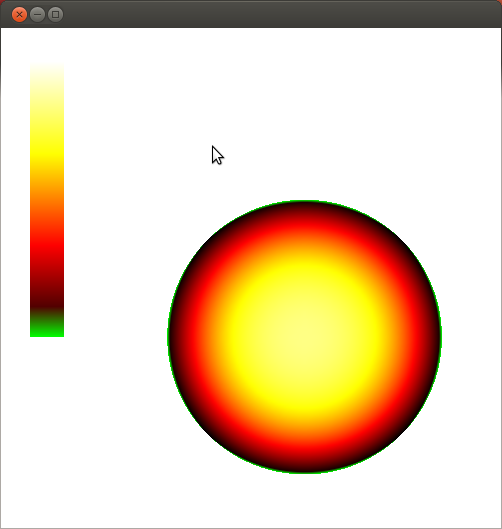
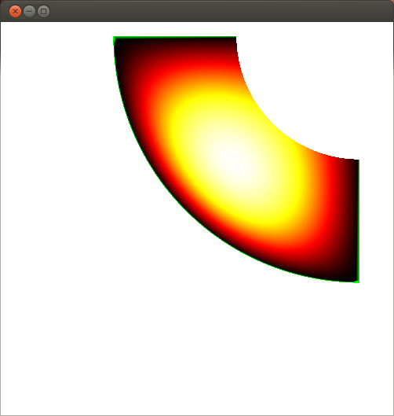
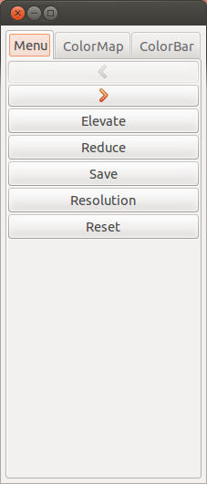
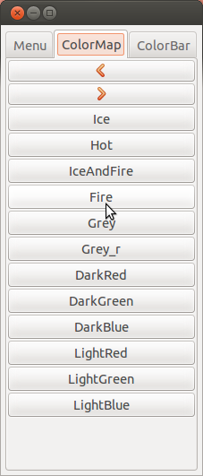
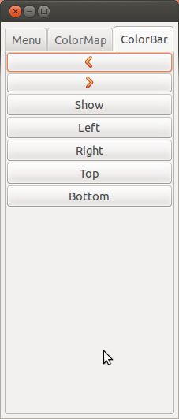

.. role:: envvar(literal)
.. role:: command(literal)
.. role:: file(literal)
.. role:: ref(title-reference)
.. _fields:

Fields
======

**CAID** can be used to visualize *B-spline/NURBS* objects defined on a given *geometry*. These objects can be the result of you own B-spline based solver, or using **pigasus**. For the moment, only the **pfl** extension, which is based on **XML** format, is allowed. The solution must be defined as a couple *(geometry,geometry_v)* where *geometry* describes the mapping and *geometry_v* the *B-spline/NURBS* objects. In **igakit** and **CAID**, this is known as a *field*. 

An example of use is the following::

   caid U.pfl

You can find in *caid/models/fields* some examples of such fields. In figures (Fig. inspector_field_poisson_circle_ Fig. inspector_field_neumann_quart_circle_) we show some of them:

.. _inspector_field_poisson_circle:

   Plot of the numerical solution of the Poisson equation on a circle.

.. _inspector_field_neumann_quart_circle:

   Plot of the numerical solution of the Laplace equation, with Neumann boundaries conditions, on a quart-circle.

.. note:: The actual version in **CAID** uses a Python loop to evaluate and draw all Bezier surfaces. A new version based on OpenGL shaders has been implemented, which uses GPU capabilities. This is a work under progress.

Viewer
******

Viewer Menu
^^^^^^^^^^^

* **Zoom In/Out**

Can be done by moving the mouse wheel or its equivalent on laptop.

* **Camera Position**

To change the camera position maintain the left button pressed while mouving the mouse.

Direct Actions
^^^^^^^^^^^^^^

Here are given the list keybord shortcuts.

* **m or M**

  Access the Viewer Preferences window

* **ESC**

  Closes the Viewer window  

.. _viewer_preferences_label:

Viewer Preferences
^^^^^^^^^^^^^^^^^^

Shows the *Viewer Preferences* window which is a notebook containing the following pages 
  
  
1- The Menu page (Fig. inspector_field_viewer_fig_preferences_grid_).

.. _inspector_field_viewer_fig_preferences_grid:

   Viewer Preferences: The Menu page.

2- The colors page (Fig. inspector_field_viewer_fig_preferences_colors_).

.. _inspector_field_viewer_fig_preferences_colors:

   Viewer Preferences: The colormap page.

3- The viewer page (Fig. inspector_field_viewer_fig_preferences_viewer_).

.. _inspector_field_viewer_fig_preferences_viewer:

   Viewer Preferences: The colorbar page.

.. Local Variables:
.. mode: rst
.. End:
