.. role:: envvar(literal)
.. role:: command(literal)
.. role:: file(literal)
.. role:: ref(title-reference)
.. _geometry_actions:

Geometry Actions
================

New
***

Creates a new predefined *geometry* object. (Fig geometry_actions_fig1_)

.. _geometry_actions_fig1:
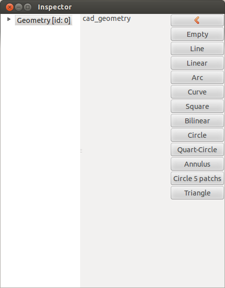

   Inspector - geometry actions: Interface to create a new geometry object.

Empty
^^^^^

Creates an empty *geometry* object.

Line
^^^^

Creates a unit *Linear* object.

Linear
^^^^^^

Creates a *Linear* object, that links the point **A** to the point **B**.

.. _geometry_actions_fig2:
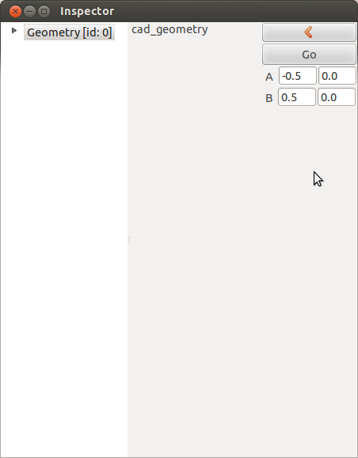

   Inspector - geometry actions: Interface to create a linear object.

Arc
^^^

Creates a *Arc* object, 

.. _geometry_actions_fig3:
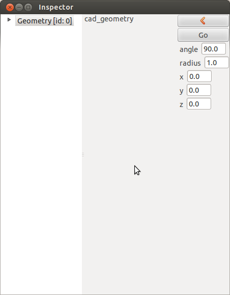

   Inspector - geometry actions: Interface to create an arc.

Curve
^^^^^

Creates a *Curve* object, 

.. _geometry_actions_fig4:
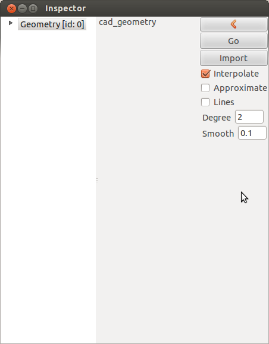

   Inspector - geometry actions: Interface to create a curve, by interpolation or approximation.

Square
^^^^^^

Creates a unit *Square* object.

Bilinear
^^^^^^^^

Creates a *Bilinear* object, 

.. _geometry_actions_fig5:
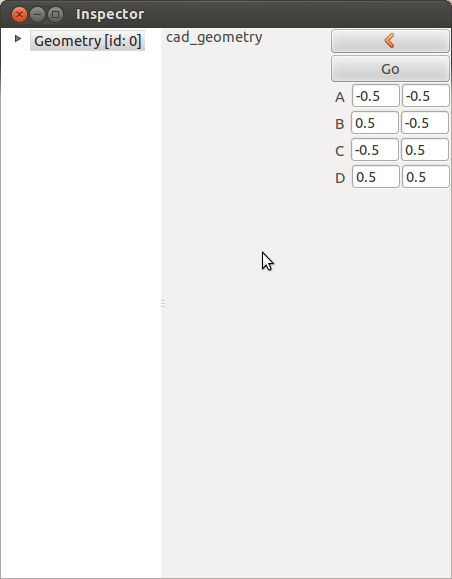

   Inspector - geometry actions: Interface to create a bilinear object.

Circle
^^^^^^

Creates a *Circle* object, 

.. _geometry_actions_fig6:
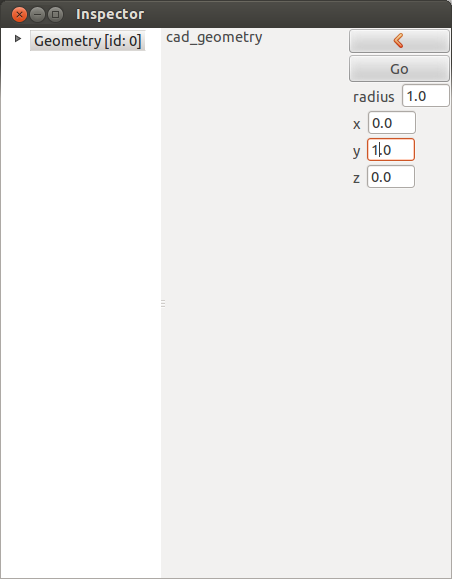

   Inspector - geometry actions: Interface to create a circle.

Quart-Circle
^^^^^^^^^^^^

Creates a *Quart-Circle* object, 

.. _geometry_actions_fig7:
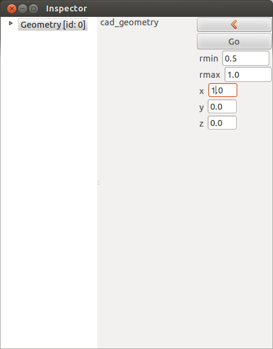

   Inspector - geometry actions: Interface to create a quart-circle.

Annulus
^^^^^^^

Creates an *Annulus* object, 

.. _geometry_actions_fig8:
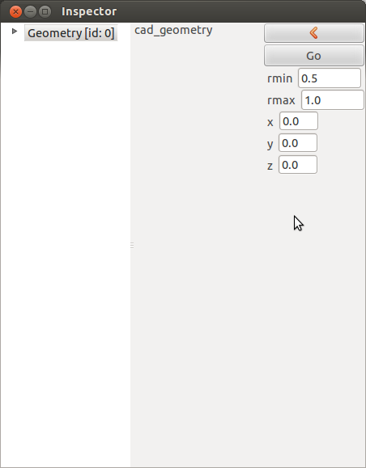

   Inspector - geometry actions: Interface to create an annulus.

Circle using 5 patchs
^^^^^^^^^^^^^^^^^^^^^

Creates a multi-patch *Circle* object, with an inside circle.

.. _geometry_actions_fig9:
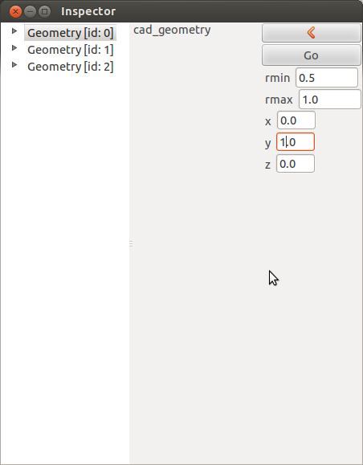

   Inspector - geometry actions: Interface to create a circle using 5 patchs, with an inside circle.

Triangle
^^^^^^^^

Creates a *Triangle* object.

.. _geometry_actions_fig10a:
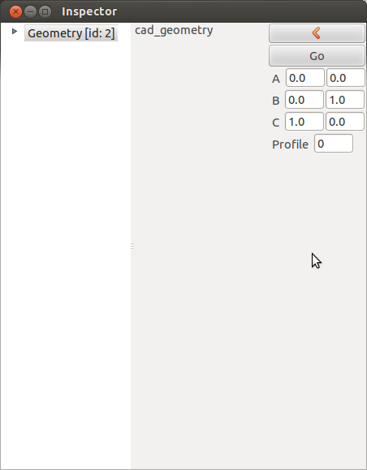

   Inspector - geometry actions: Interface to create a triangle.

The following figures shows the triangle depending on its profile value.

.. _geometry_actions_fig10b:
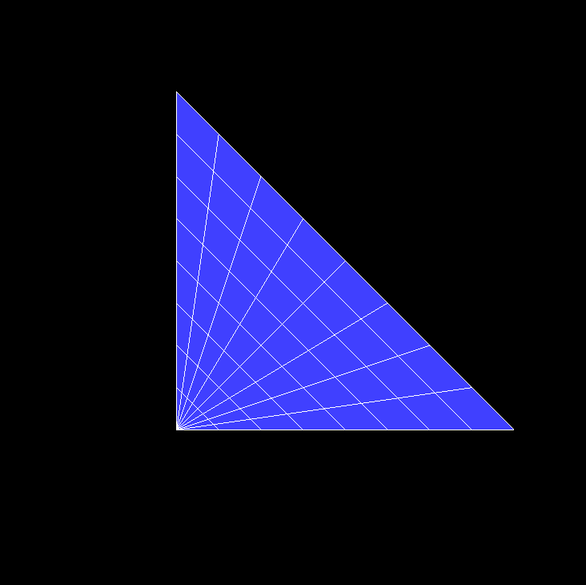

   triangle of profile 0.

.. _geometry_actions_fig10c:

   triangle of profile 1.

.. _geometry_actions_fig10d:
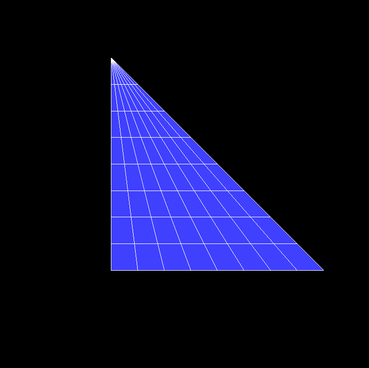

   triangle of profile 2.

.. _geometry_actions_fig10e:

   triangle of profile 3.

.. raw:: latex

   \newpage % hard pagebreak at exactly this position

Delete
******

Deletes the current (selected) *geometry*. This can also be done by pressing **DEL**.

Duplicate
*********

.. todo:: rajouter le ctrl-c ctrl-v

Duplicates the current (selected) *geometry*. This can also be done by pressing **CTRL-C** followed by **CTRL-V**.

Add Patch
*********

This opens the same interface as for the *new* action. Rather than creates a new *geometry* object, it appends the corresponding *patchs* to the current *geometry*.

Plot Jacobian
*************

Plots the Jacobian of the current (selected) *geometry*. The plot is done by *matpotlib.pyplot*. In order to have better resolution, you can right-click on the *geometry* in the Inspector window, and set the *Mesh steps* variable.

Plot Mesh
*********

Plots the Mesh of the current (selected) *geometry*. The plot is done by *matpotlib.pyplot*. In order to have better resolution, you can right-click on the *geometry* in the Inspector window, and set the *Mesh steps* variable.

.. note:: This action is deprecated for geometries with big number of control points. In this case, use directly the *print* action of the *viewer*.

.. _polar-extrude-action:

Polar Extrude
*************

Creates a *2D* polar like domain from a B-spline curve. In **caid/models/model_003/**, we give the boundary description of a Grad-Shafranov analytical solution (Fig geometry_actions_fig11a_).

.. _geometry_actions_fig11a:
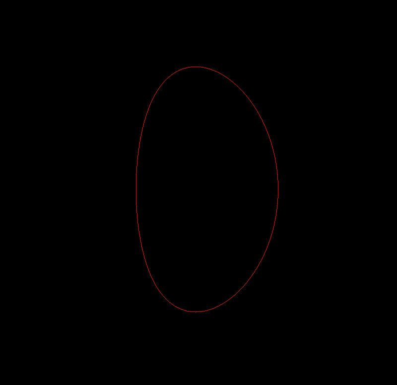

   Importing the Grad-Shafranov boundary description in CAID.

The interface of the *Polar Extrude* action is given in (Fig geometry_actions_fig11b_). The user can specify the *scale*

* :math:`0` for a polar description, 

* otherwise :math:`1>scale>0` will scale the boundary,

* :math:`(x,y,z)` are the coordinates of the center of the domain. If not given, it is automatically computed using the mean values of the boundary coordinates.

.. _geometry_actions_fig11b:
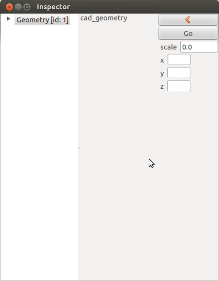

   Inspector - geometry actions: Polar Extrude Interface.

Using a *scale* factor equal to 0, we get the following mesh

.. _geometry_actions_fig11c:
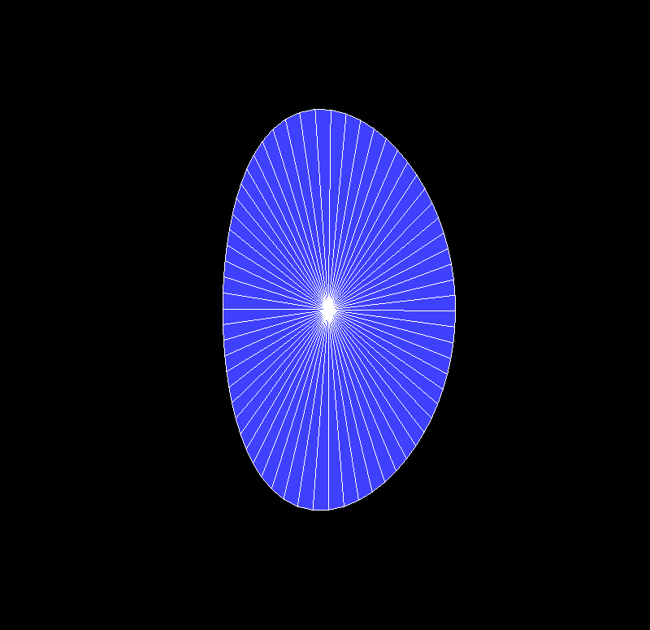

   An initial 2D Grad-Shafranov mesh using 63 internal knots in the theta direction, with a cubic B-spline. In the radial direction, a linear description is used.

.. _geometry_actions_fig11d:
.. figure::     images/grad_shafranov_mesh.png
   :align:      center
   :width: 10cm
   :height: 10cm

   A Grad-Shafranov mesh using a grid of 63x63 internal knots and cubic B-splines.

.. raw:: latex

   \newpage % hard pagebreak at exactly this position

Edit
****

Edits the selected *geometry*. This opens a new window (Editor). When the geometry is modified, **CAID** automatically creates a new geometry and add it in the *Inspector*.

.. _geometry_actions_fig12:
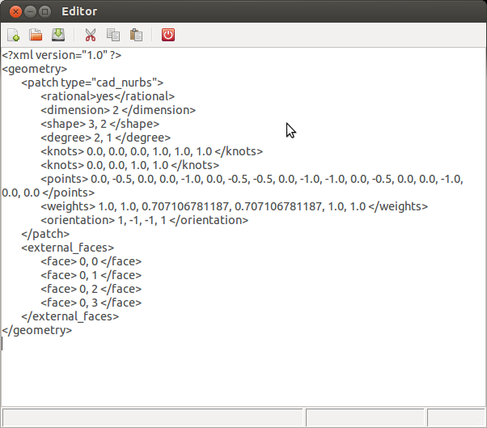

   Inspector - geometry actions: Geometry Editor window.

Translate
*********

Translates the current *geometry* with the specified displacement.

.. _geometry_actions_fig13:
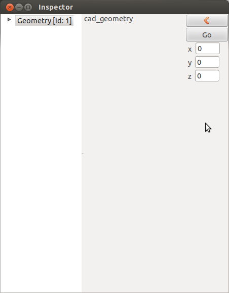

   Inspector - geometry actions: Interface for the Translate action.

Rotate
******

Rotates the current *geometry* with a given *angle* with respect to *axis*

.. _geometry_actions_fig14:
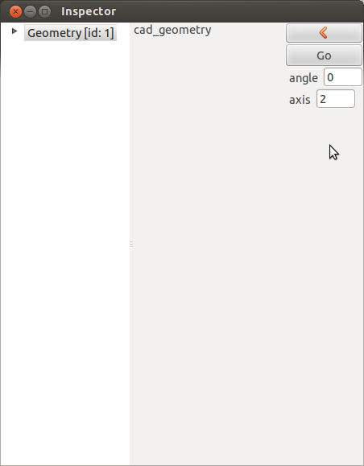

   Inspector - geometry actions: Interface for the Rotate action.

Scale
*****

Scales the current *geometry* with a given *scale* in the direction *axis*. If *axis* is not specified, the scaling operation will be done over all directions.

.. _geometry_actions_fig15:
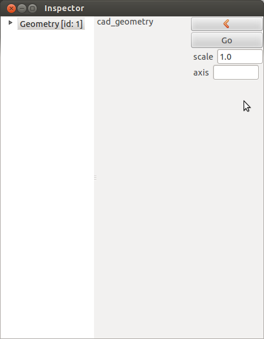

   Inspector - geometry actions: Interface for the Scale action.

Refine
******

Refines the current *geometry*. The user must specify the numer of internal knots, and the final B-spline degree.

.. _geometry_actions_fig16:
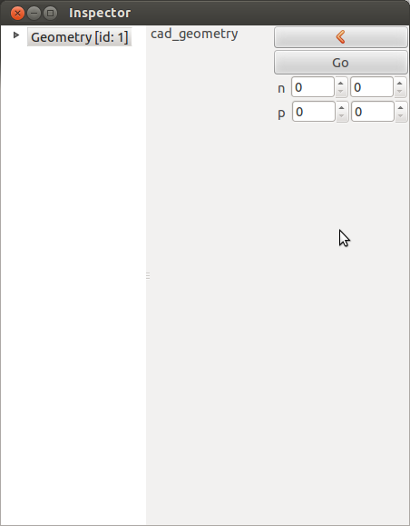

   Inspector - geometry actions: Interface for the Refine action.

Import
******

Imports a *geometry* object that has been stored in the **xml** format.

Export
******

Exports the current *geometry*. For the moment 3 formats can be specified:

* **xml** format used by *Pigasus*

* **txt** format used by *SeLaLib*.

* **zip**   

Expand
******

Expands the current *geometry*: creates a *geometry* object for each *patch*. 

To 5 Patchs
***********

Generates a 5 patchs description from a polar description. In the following example, we use the analytical Grad-Shafranov boundary with the *Polar Extrude* function to create the following geometry. The *scaling* factor is 2 (Fig geometry_actions_fig17a_)

.. _geometry_actions_fig17a:
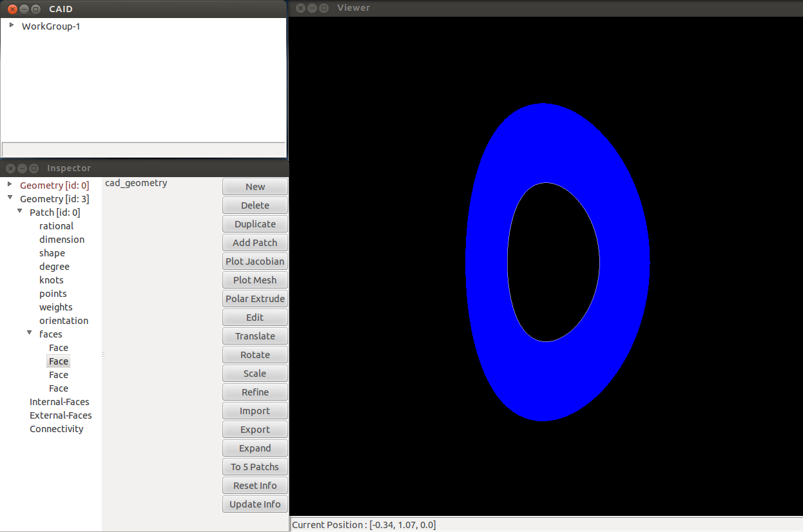

   A Grad-Shafranov mesh using a grid of 63x0 internal knots and cubic x linear B-splines.

By pressing the *To 5 patchs* button, a new *geometry* is created and the *hole* is filled. The final mesh is given in (Fig geometry_actions_fig17b_)

.. _geometry_actions_fig17b:
.. figure::     images/grad_shafranov_mesh_5patchs.png
   :align:      center
   :width: 10cm
   :height: 10cm

   A Grad-Shafranov mesh using a grid of 63x63 internal knots and cubic B-splines.

Reset Info
**********

Resets the *Internal_faces*, *External_faces* and *connectivity* informations of the current *geometry*.

Update Info
***********

Computes the *Internal_faces*, *External_faces* and *connectivity* informations of the current *geometry*. Whenever, there is a problem with the orientation of commun faces, **CAID** will tell it.

.. raw:: latex

   \newpage % hard pagebreak at exactly this position

Direct Actions
**************

.. todo:: a rajouter

Right click Actions
*******************

* **Show** 
  
  shows the current *geometry*

* **Hide** 
  
  hides the current *geometry* 

* **Show Mesh** 
  
  shows the mesh of the current *geometry* 

* **Hide Mesh** 
  
  hides the mesh of the current *geometry* 

* **Show Control Points** 
  
  shows the control points of the current *geometry* 

* **Hide Control Points** 
  
  hides the control points of the current *geometry* 

* **Paste** 
  
  pastes the *geometry* or *patch* that has been copied before from the clipboard

* **Rename** 
  
  renames the current *geometry*. Also can be done by pressing **F2**

* **Color** 
  
  sets the color for the current *geometry*. This color is used for every *patch* inside the *geometry* for which a local color has not been specified

* **Mesh steps** 
  
  sets the *mesh steps* for the current *geometry*. It is used to draw the global mesh. Note that this functionality is only for visualization purposes and does not lead to refining the *geometry*

* **Create Vectorial Space** 
  
  creates a *vectorial space* for the current *geometry* once the *boundary conditions* have been specified

* **Set Boundary Conditions** 
  
  sets *boundary conditions* for the current *geometry*. The user must press on *Save Boundary Conditions* before creating a *vectorial space*

* **Save Boundary Conditions** 
  
  saves the *boundary conditions* that will be used later to create the *vectorial space*

* **Dirichlet Boundary Condition** 
  
  sets *Dirichlet boundary conditions* on the current *geometry*

* **Properties** 
  
  shows some *properties* of the current *geometry*

.. Local Variables:
.. mode: rst
.. End:
