.. role:: envvar(literal)
.. role:: command(literal)
.. role:: file(literal)
.. role:: ref(title-reference)
.. _patch_actions:

Patch Actions
================

Approximate
***********

.. todo:: add an example

Bezier
******

Converts the current *patch* into a collection of *Bezier* patchs (Fig patch_actions_fig_beziera_)

.. _patch_actions_fig_beziera:
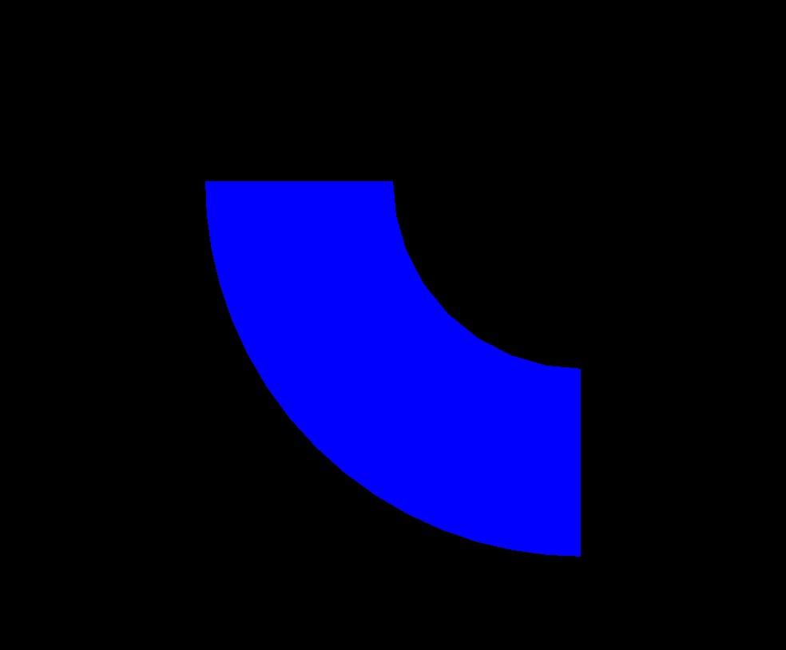

   Patch actions: Patch before the Bezier action.

The final result is giving in (Fig patch_actions_fig_bezierb_)

.. _patch_actions_fig_bezierb:
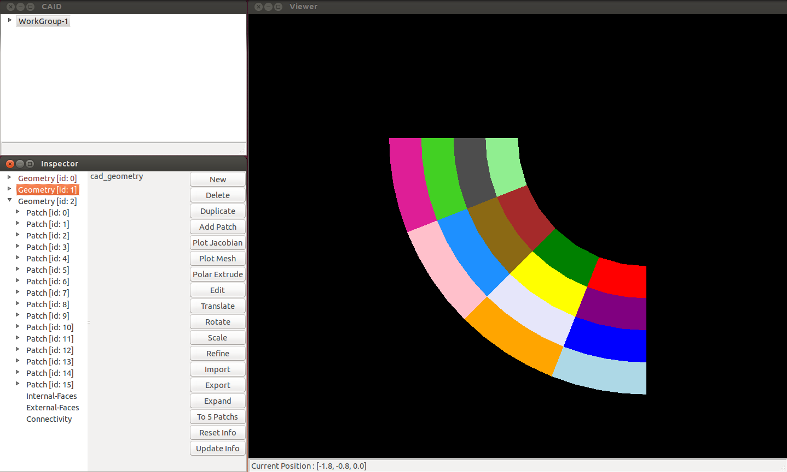

   Patch actions: The resulting patchs after Bezier action.

Now, by selecting the current *geometry* and clicking on **Update Info**, we compute the global connectivity as well as *Internal/External faces* (Fig patch_actions_fig_bezierc_)

.. _patch_actions_fig_bezierc:
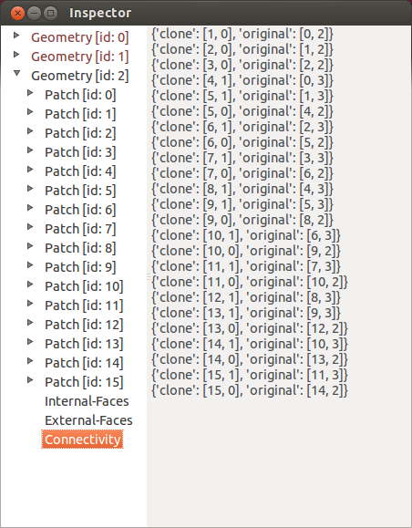

   Patch actions: The resulting connectivity after Bezier action.

.. raw:: latex

   \newpage % hard pagebreak at exactly this position

Clamp
*****

Transforms the uniform knot vector of the selected *patch* to an open knot vector. The user can specify the *axis* and the *side* of the knot vector.

.. note:: see the Unclamp action, for the inverse operation.

.. _patch_actions_fig_clampa:
.. figure::     images/patch_actions_clamp.png
   :align:      center

   Patch actions: Patch and its Control Points, before the Clamp action.

The final result is giving in (Fig patch_actions_fig_clampb_)

.. _patch_actions_fig_clampb:
.. figure::     images/patch_actions_clamp_result.png
   :align:      center

   Patch actions: The resulting patch after Clamping the patch in the two direction and both sides.

.. _patch_actions_fig_clampc:
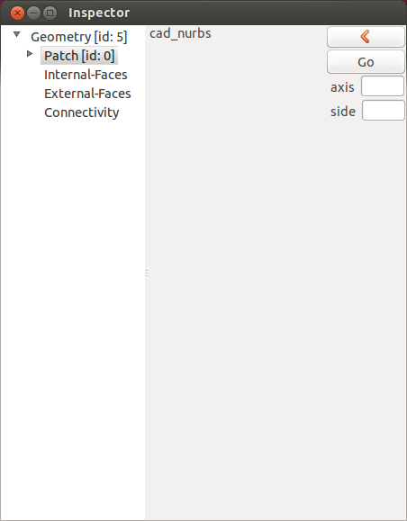

   Patch actions: The Clamp action interface.

.. raw:: latex

   \newpage % hard pagebreak at exactly this position

Clone Points
************

.. todo:: add an example

Compat
******

Makes a list of *patchs* of the same knot vectors.

.. _patch_actions_fig_compata:
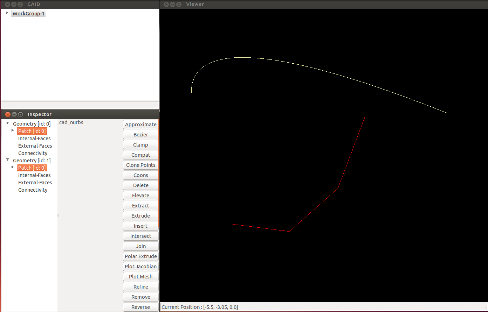

   Patch actions: Two curves, before the compat action.

.. _patch_actions_fig_compatb:
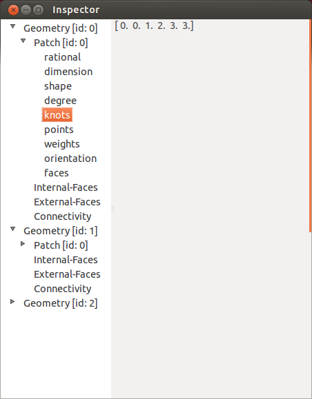

   Patch actions: The inspector interface for the compat action. Notice the knot vector of the current curve.

.. _patch_actions_fig_compatc:
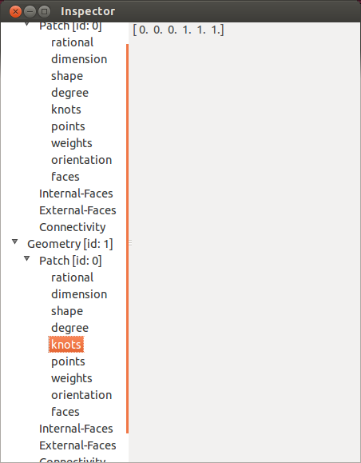

   Patch actions: The inspector interface for the compat action. Notice the knot vector of the current curve.

The final result is giving in the next figures (Fig patch_actions_fig_compatd_, patch_actions_fig_compate_)

.. _patch_actions_fig_compatd:
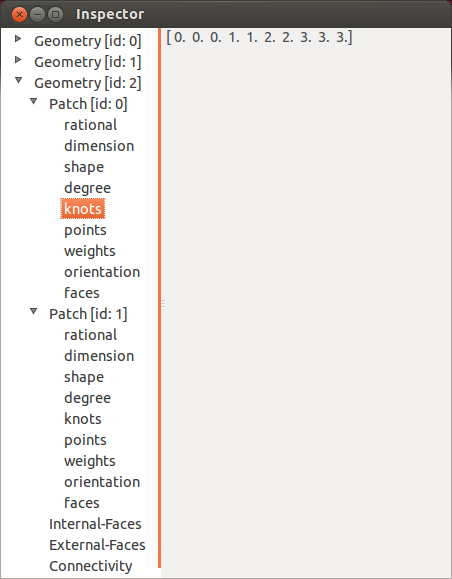

   Patch actions: The inspector interface for the compat action. Notice the new knot vector of the current curve.

.. _patch_actions_fig_compate:
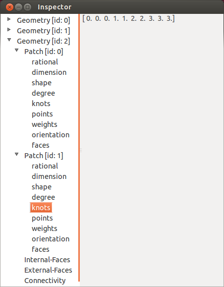

   Patch actions: The inspector interface for the compat action. Notice the new knot vector of the current curve.

Coons
*****

Creates a **2D** *patch* given 4 curves (boundaries) using the *Coons* algorithm. (Fig patch_actions_fig_coonsa_)

.. _patch_actions_fig_coonsa:

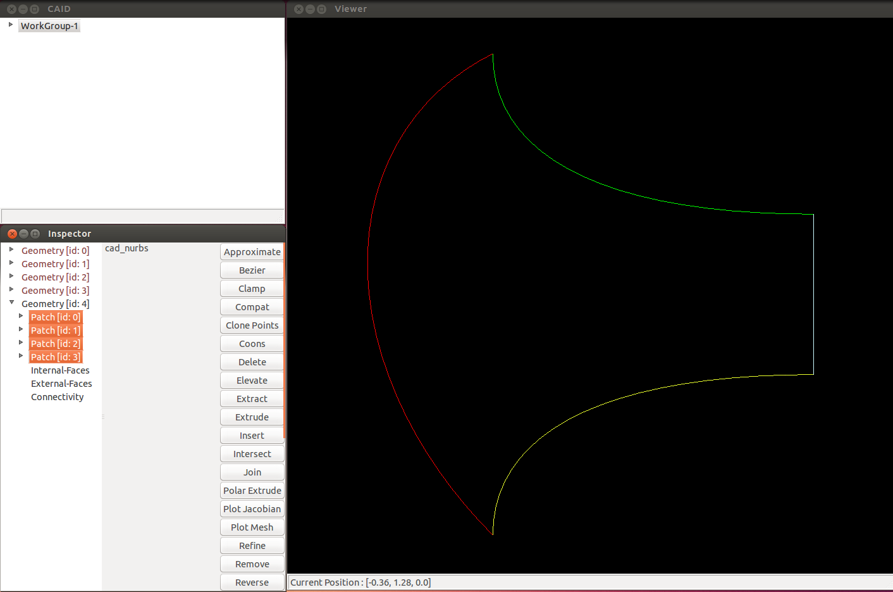

   Patch actions: 4 curves describing the boundary of the 2D domain before applying the coons algorithm.

.. note:: In order to apply the coons algorithm, you need to do a multiple selection of the boundaries by maintining **CTRL** while selecting the curves. Note that the actual version does not know the selection order which is very important as it follows the parametric faces numbering. An actual solution is to create a new empty *geometry*, and then copy the boundaries in the correct order. 

The final result is giving in (Fig patch_actions_fig_coonsb_)

.. _patch_actions_fig_coonsb:

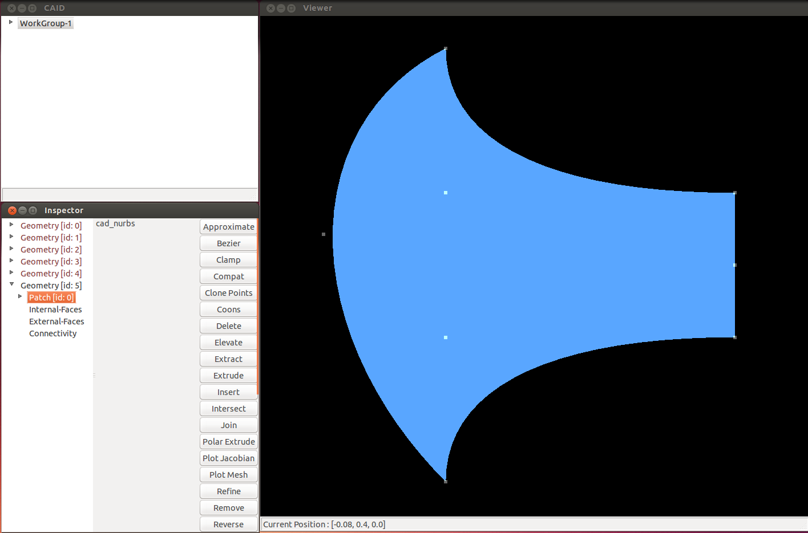

   Patch actions: The resulting patch after applying the coons algorithm.

.. raw:: latex

   \newpage % hard pagebreak at exactly this position

Delete
******

Deletes the current (selected) *patch* object.

Elevate
*******

Elevates the spline degree of the current *patch*. (Fig patch_actions_fig_elevatea_)

.. _patch_actions_fig_elevatea:
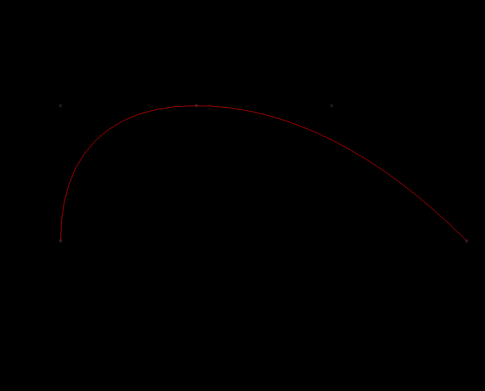

   Patch actions: Patch before Spline elevate degree.

.. _patch_actions_fig_elevateb:
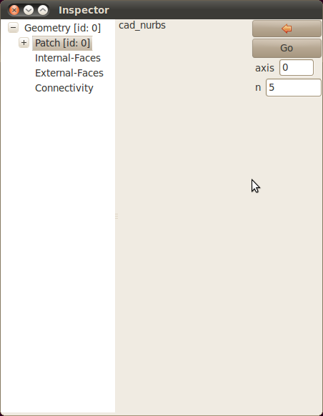

   Inspector - patch actions: Interface to elevate the spline degree of a patch.

The final result is giving in (Fig patch_actions_fig_elevatec_)

.. _patch_actions_fig_elevatec:
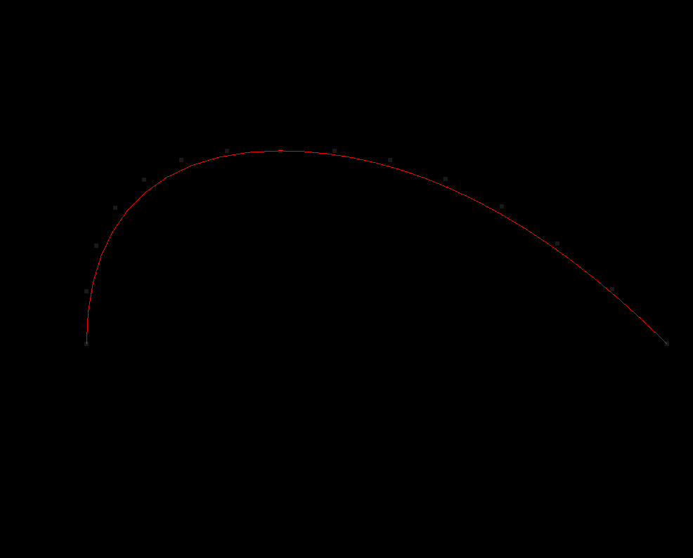

   Patch actions: The resulting patch after elevating the spline degree by 5.

.. todo:: must create a new patch, rather that making changes on the current one.   

.. raw:: latex

   \newpage % hard pagebreak at exactly this position

Extract
*******

Extracts a given *face* of the current *patch* and generate a new *geometry/patch* object describing the boundary. 

.. _patch_actions_fig_extracta:

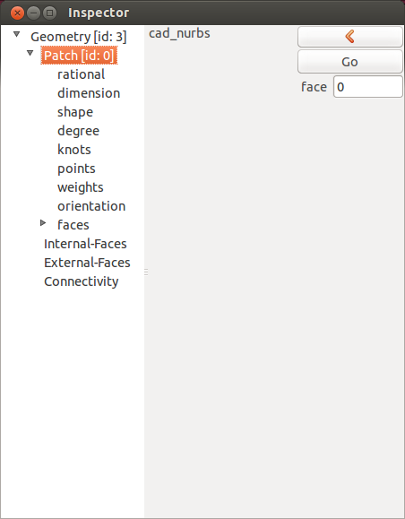

   Patch actions: Extract face interface.

.. note:: This can be done also by choosing the *face* (it will be highlighted on the *Viewer*) to extract in the *Inspector* and right click on *Extract* (Fig patch_actions_fig_extractb_).

.. _patch_actions_fig_extractb:

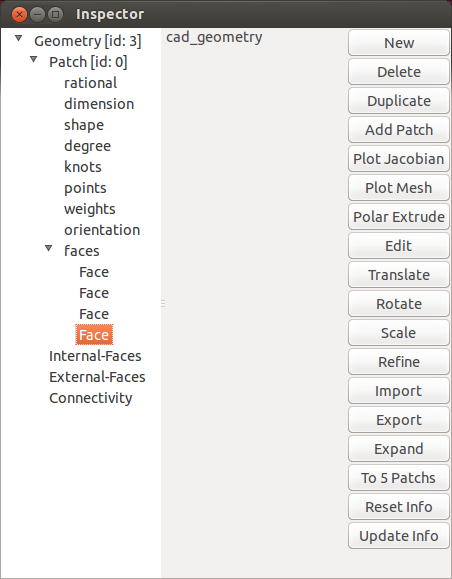

   Patch actions: Extract face interface.

Extrude
*******

.. _patch_actions_fig_extrudea:

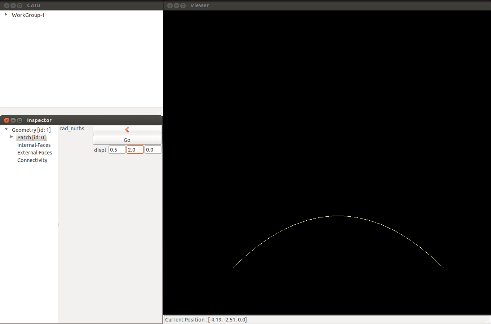

   Patch actions: Curve before the Extrude action.

The final result is giving in (Fig :ref:`patch_actions_fig_extrudeb`)

.. _patch_actions_fig_extrudeb:

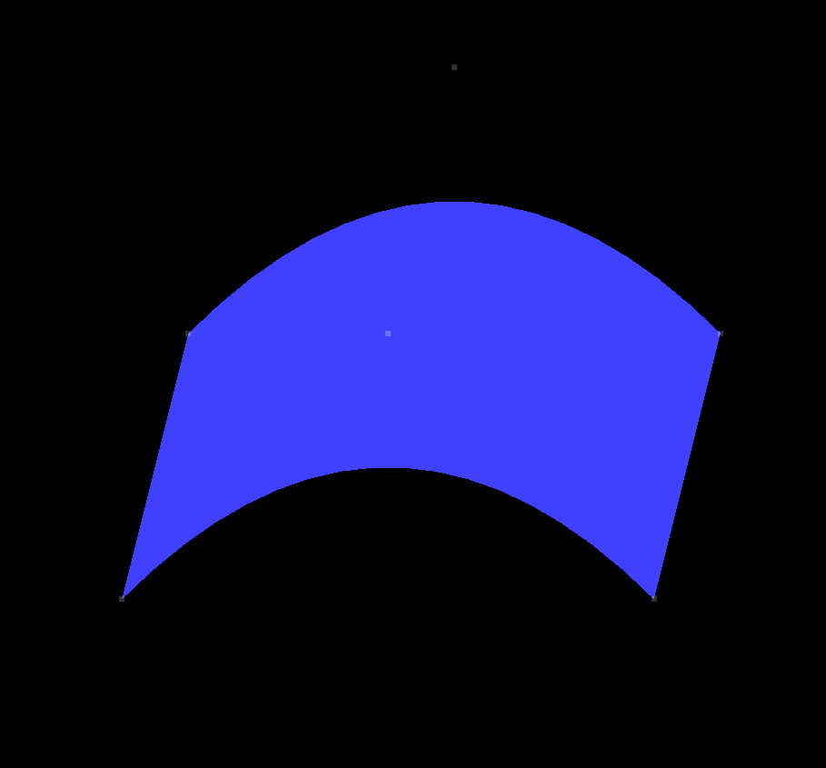

   Patch actions: The resulting patch after extruding the curve with the displacement :math:`[\frac{1}{2}, 2, 0]`.

.. raw:: latex

   \newpage % hard pagebreak at exactly this position

Insert
******

Insert a new knot in the *patch* object. (Fig patch_actions_fig_inserta_)

.. _patch_actions_fig_inserta:
.. figure::     images/patch_actions_insert.png
   :align:      center
   :width: 10cm
   :height: 10cm

   Patch actions: Patch befor knot insertion.

.. _patch_actions_fig_insertb:
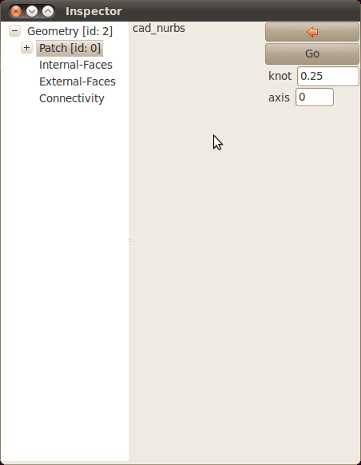

   Inspector - patch actions: Interface to insert new knots.

The final result is giving in (Fig patch_actions_fig_insertc_)

.. _patch_actions_fig_insertc:
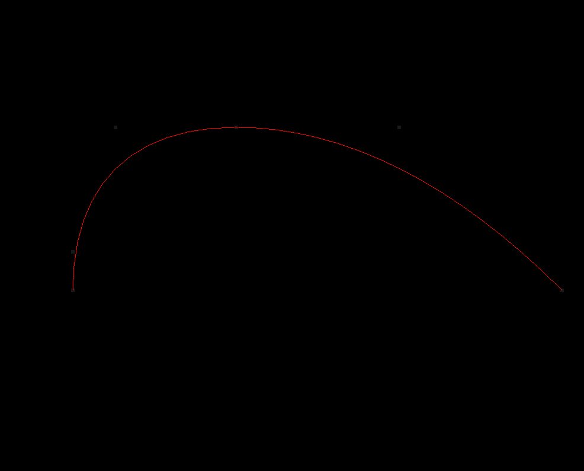

   Patch actions: The resulting patch after inserting the knot :math:`\frac{1}{4}`.

.. raw:: latex

   \newpage % hard pagebreak at exactly this position

Intersect
*********

Computes the intersection two *patch* objects (only curves for the moment) and split them into new *patchs*. (Fig patch_actions_fig_intersecta_)

.. _patch_actions_fig_intersecta:
.. figure::     images/patch_actions_intersect.png
   :align:      center

   Patch actions: Intersection of two patchs.

.. note:: In order to do multiple selection, press **CTRL** while selecting the two patchs.   

The final result is giving in (Fig patch_actions_fig_intersectb_)

.. _patch_actions_fig_intersectb:
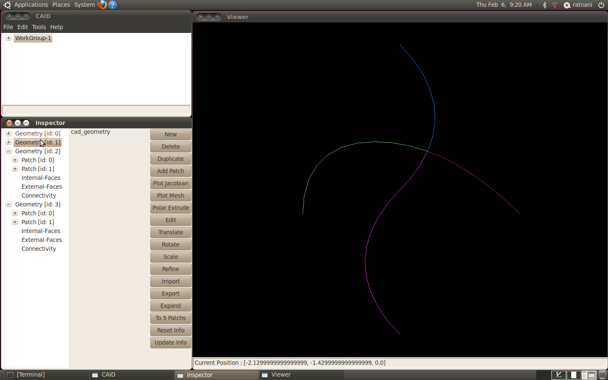

   Patch actions: The resulting 4 patchs after the intersection process.

.. raw:: latex

   \newpage % hard pagebreak at exactly this position

Join
****

Merges two *patch* objects to form one single patch. (Fig patch_actions_fig_joina_)

.. _patch_actions_fig_joina:
.. figure::     images/patch_actions_join.png
   :align:      center

   Patch actions: Merging two patchs.

.. note:: In order to do multiple selection, press **CTRL** while selecting the two patchs.   

.. _patch_actions_fig_joinb:
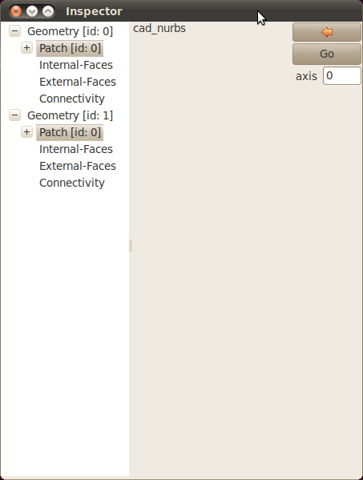

   Inspector - patch actions: Interface to join/merge two patch objects.

.. todo:: makes it possible to choose different axis for the two patchs.   

The final result is giving in (Fig patch_actions_fig_joinc_)

.. _patch_actions_fig_joinc:
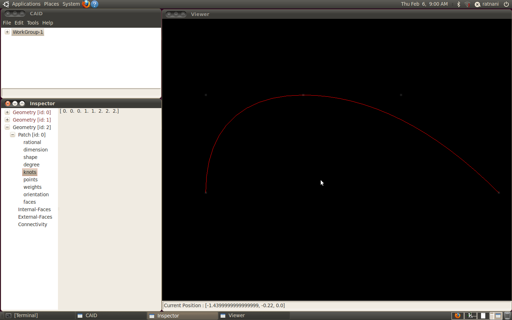

   Patch actions: The resulting patch after the Merging process.

Plot Jacobian
*************

Plots the Jacobian of the current (selected) *patch*. The plot is done by *matpotlib.pyplot*. In order to have better resolution, you can right-click on the *patch* in the Inspector window, and set the *Mesh steps* variable.

Plot Mesh
*********

Plots the Mesh of the current (selected) *patch*. The plot is done by *matpotlib.pyplot*. In order to have better resolution, you can right-click on the *patch* in the Inspector window, and set the *Mesh steps* variable.

.. note:: This action is deprecated for geometries with big number of control points. In this case, use directly the *print* action of the *viewer*.

Polar Extrude
*************

See *geomtry* :ref:`polar_extrude_action` action.

Refine
******

Refines the current *patch* in the direction *axis*, by inserting *n* equally spaced knots. (Fig patch_actions_fig_refinea_)

.. _patch_actions_fig_refinea:

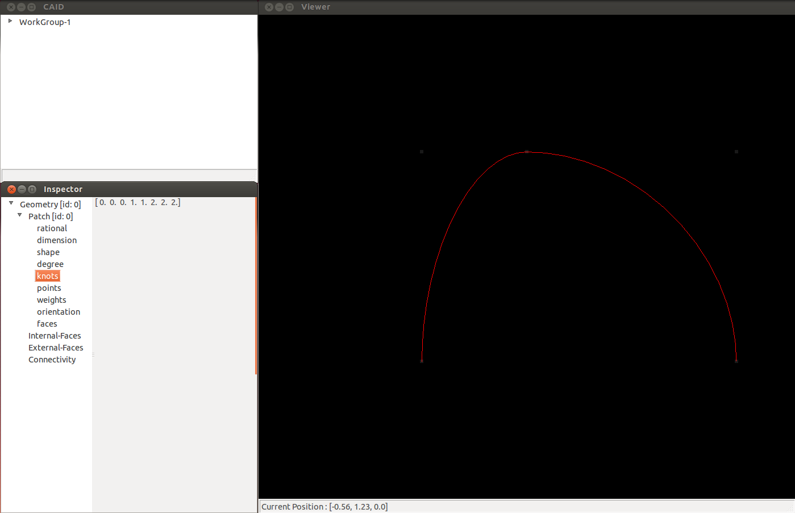

   Patch actions: Refining the patch.

.. _patch_actions_fig_refineb:

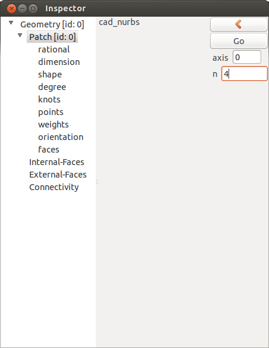

   Inspector - patch actions: Interface to the refine knot action.

The final result is giving in (Fig patch_actions_fig_refinec_)

.. _patch_actions_fig_refinec:

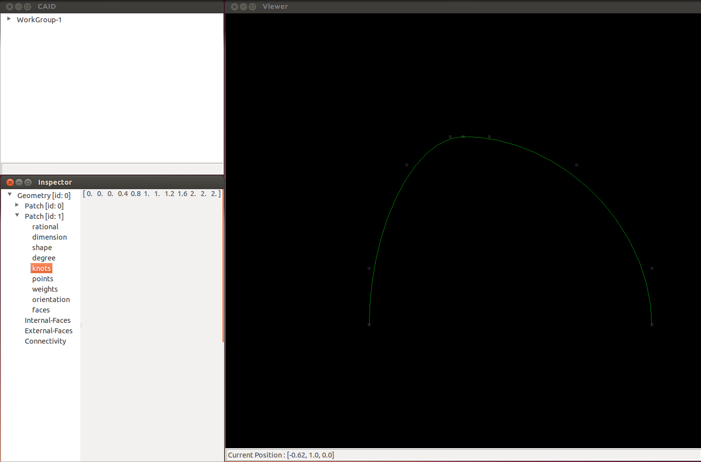

   Patch actions: The resulting patch after refining patch and inserting 4 equally spaced knots.

Remap
*****

Remap the knot vectors of the current *patch*. (Fig patch_actions_fig_remapa_)

.. _patch_actions_fig_remapa:

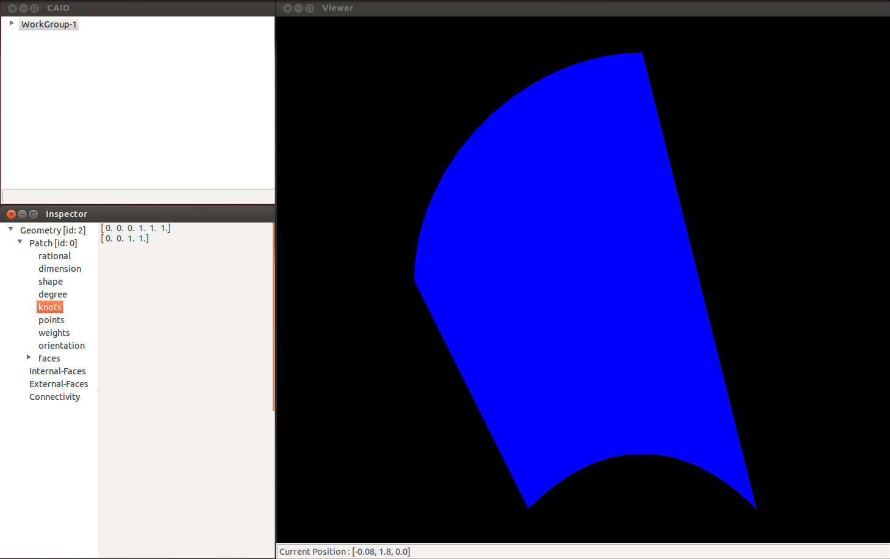

   Patch actions: Remap patch knot vectors.

.. note:: If you do not specify the axis, the remap action will operates on all directions.

.. _patch_actions_fig_remapb:

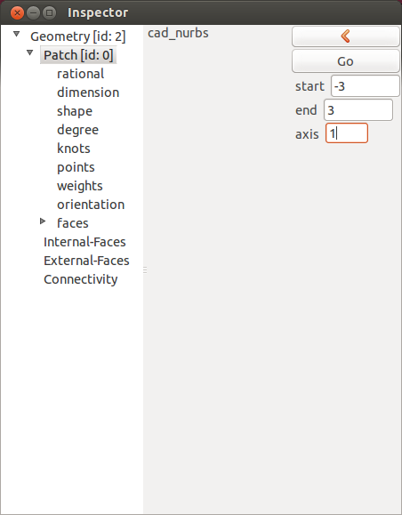

   Inspector - patch actions: Interface to remap patch knot vectors.

The final result is giving in (Fig patch_actions_fig_remapc_)

.. _patch_actions_fig_remapc:

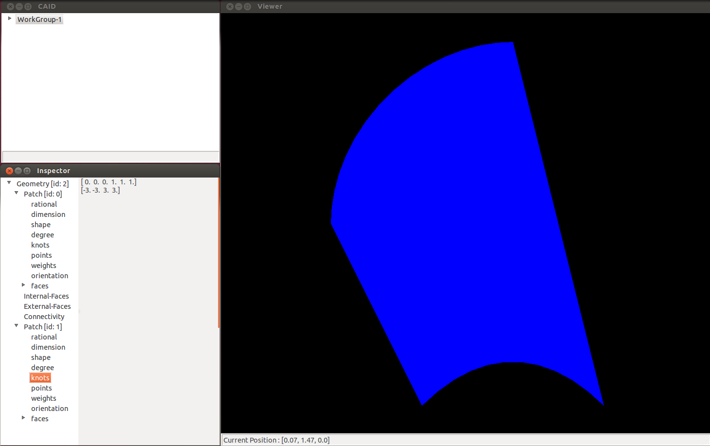

   Patch actions: The resulting patch after the remapping process.

Remove
******

Removes a given *times* the specified knot through the direction *axis* of the current *patch*. The user must give also the deviation (it is based on an iterative algorithm)(Fig patch_actions_fig_removea_)

.. _patch_actions_fig_removea:

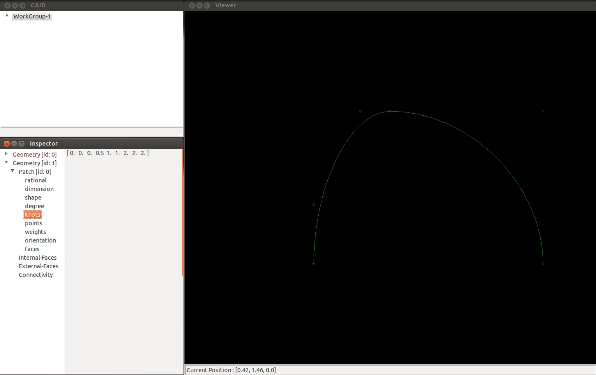

   Patch actions: Removing a knot from the patch.

.. note:: Default value for *deviation* is :math:`10^{-9}`.   

.. note:: Default value for *times* is :math:`1`.   

.. _patch_actions_fig_removeb:

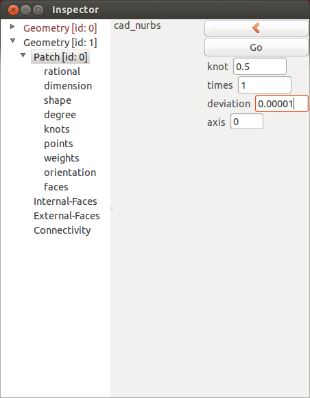

   Inspector - patch actions: Interface to the remove knot action.

The final result is giving in (Fig patch_actions_fig_removec_)

.. _patch_actions_fig_removec:

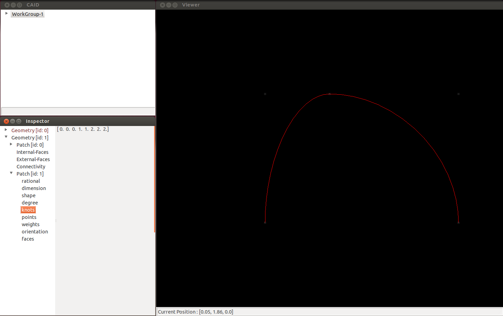

   Patch actions: The resulting patch after removing the knot :math:`\frac{1}{2}`.

Reverse
*******

Reverse the orientation of the current *patch*. The user must specify an *axis*, otherwise, **CAID** will change the orientation through all directions.

Revolve
*******

Construct a *patch* surface/volume by revolving a *patch* curve/surface with respect to an *axis*, given a *point* and the bounds of the angle.

.. _patch_actions_fig_revolvea:

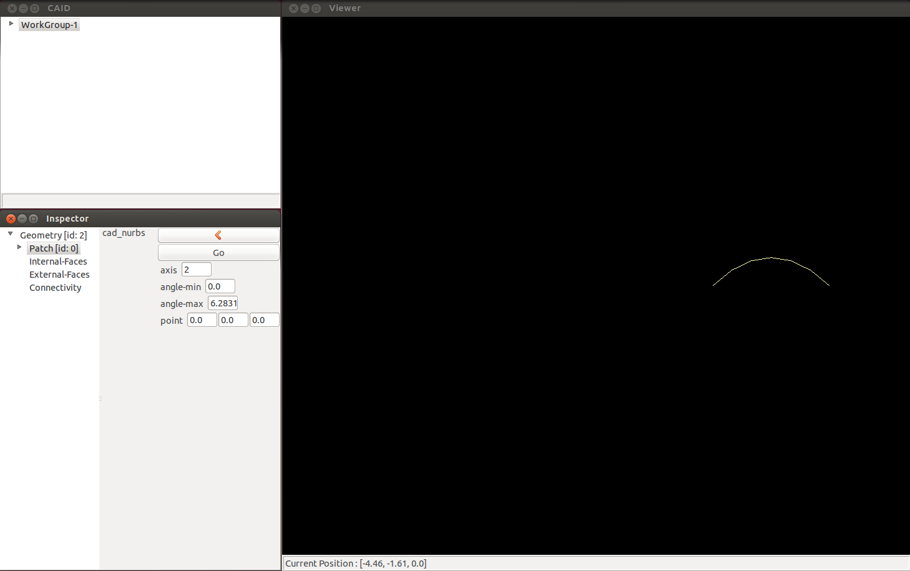

   Patch actions: Patch before the revolve action.

The final result is giving in (Fig patch_actions_fig_revolveb_)

.. _patch_actions_fig_revolveb:

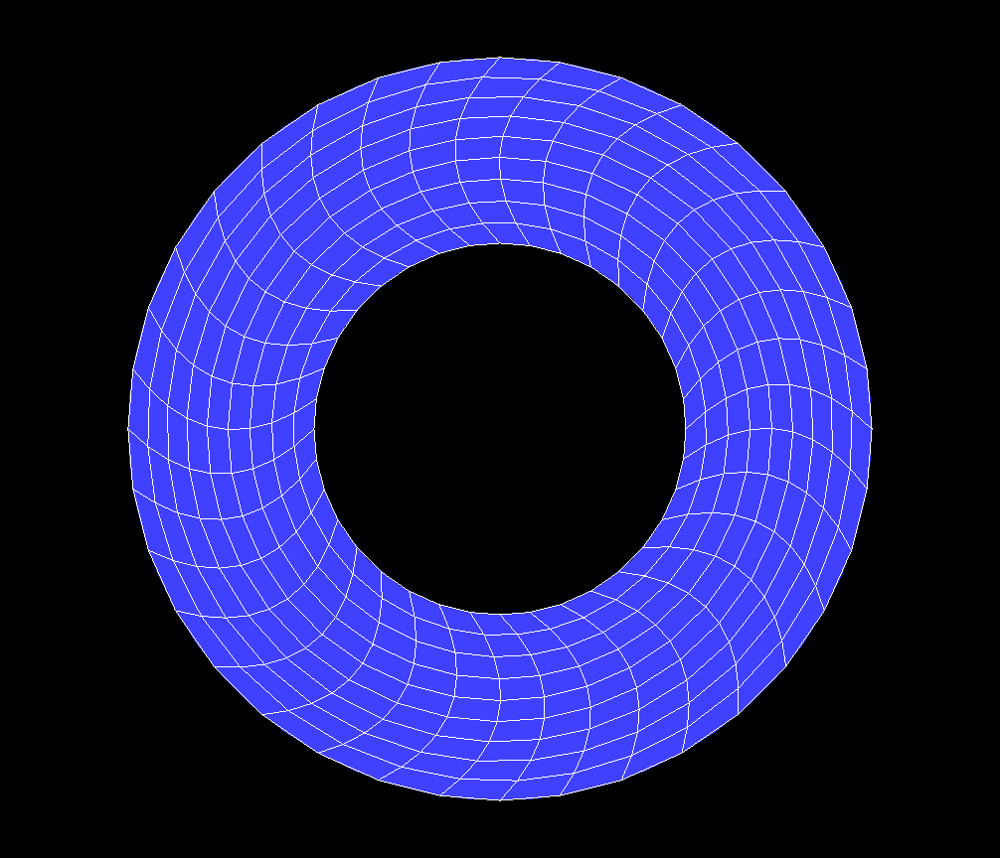

   Patch actions: The resulting patch after revolving the original curve.

.. raw:: latex

   \newpage % hard pagebreak at exactly this position

Rotate
******

Rotates the current *patch* with a given *angle* with respect to *axis*

Ruled
*****

Construct a ruled surface/volume *patch* between two *patchs* curves/surfaces.

.. _patch_actions_fig_ruleda:

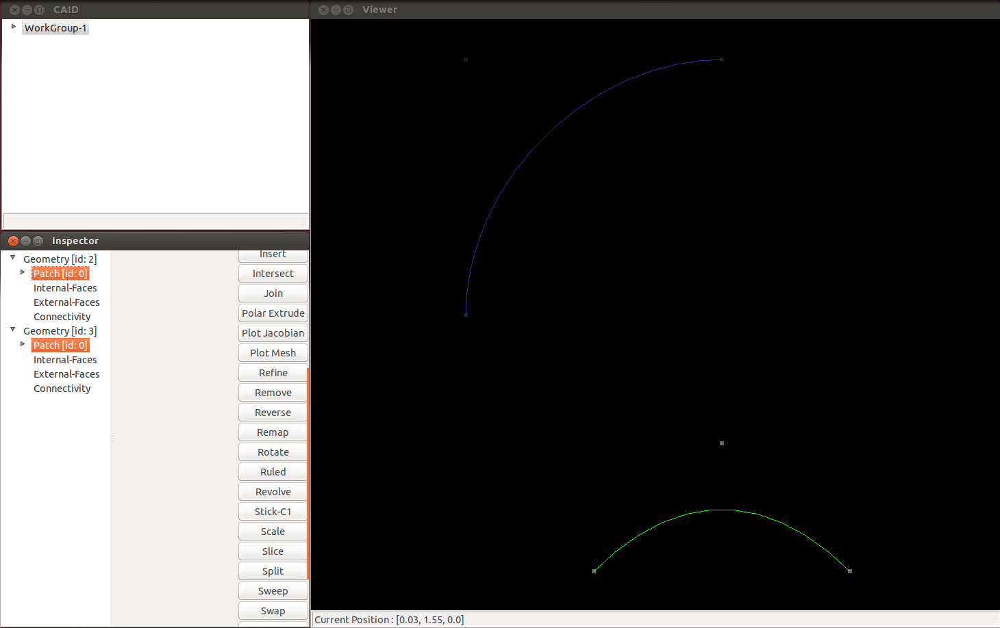

   Patch actions: Patch before the ruled action.

The final result is giving in (Fig patch_actions_fig_ruledb_)

.. _patch_actions_fig_ruledb:

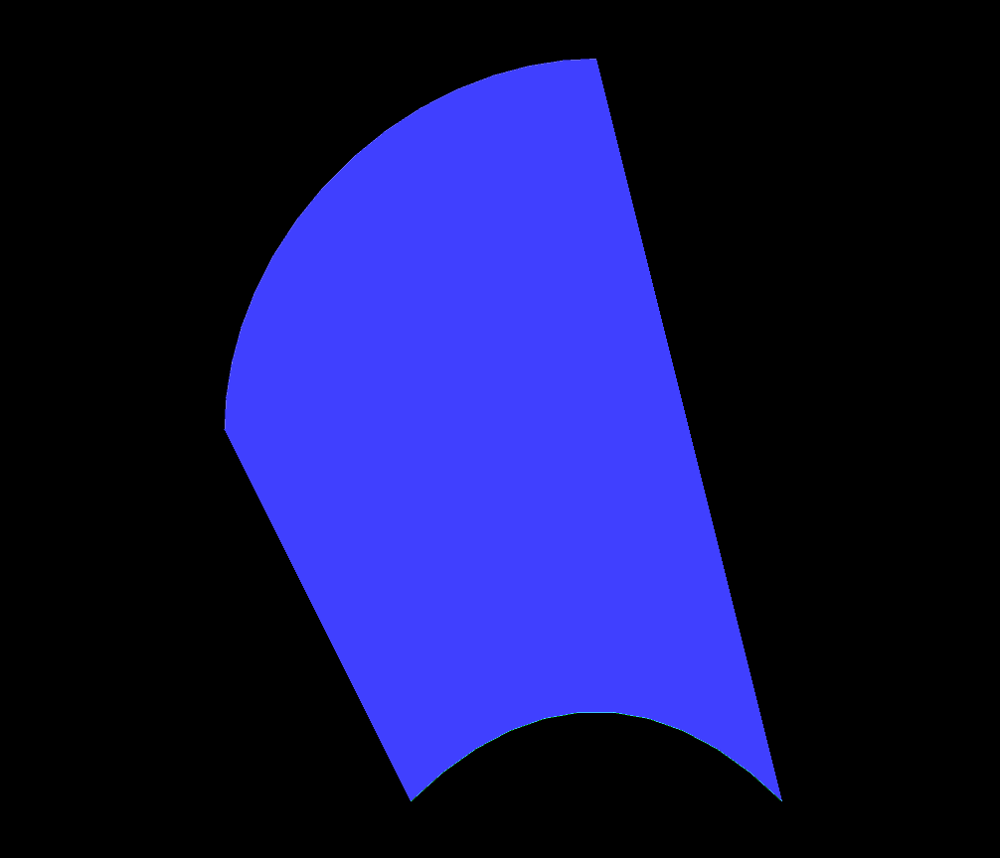

   Patch actions: The resulting patch after applying the ruled process the original curves.

.. raw:: latex

   \newpage % hard pagebreak at exactly this position

Scale
*****

Scales the current *patch* with a given *scale* in the direction *axis*. If *axis* is not specified, the scaling operation will be done over all directions.

Slice
*****

Create a new *geometry* by slicing the current *patch* with respect to an *axis* and given two bounds for the new *knot* vector. 

In the following example, we slice the annulus domain with respect to the *axis* 1, given the knot bounds 0.2 and 0.8 (Fig patch_actions_fig_slicea_)

.. _patch_actions_fig_slicea:

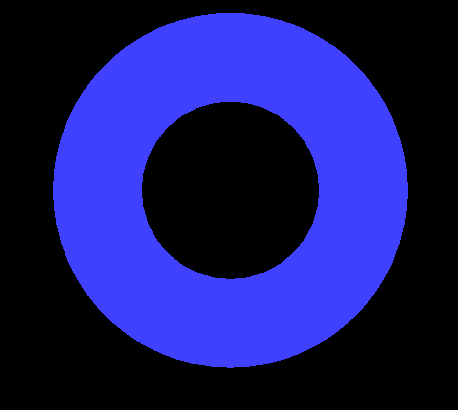

   Patch actions: Patch before splitting.

The final result is giving in (Fig patch_actions_fig_sliceb_)

.. _patch_actions_fig_sliceb:

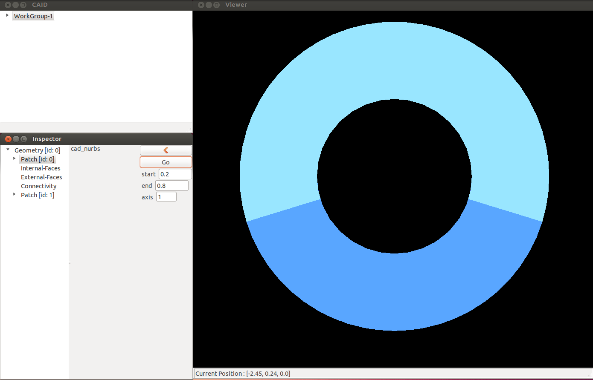

   Patch actions: The resulting patch after slicing the original patch in the *axis* 1 with respect to the bounds knot *0.2* to *0.8*.

.. raw:: latex

   \newpage % hard pagebreak at exactly this position

Split
*****

Splits the current *patch* with respect to an *axis* and a given *knot*. (Fig patch_actions_fig_splita_)

.. _patch_actions_fig_splita:

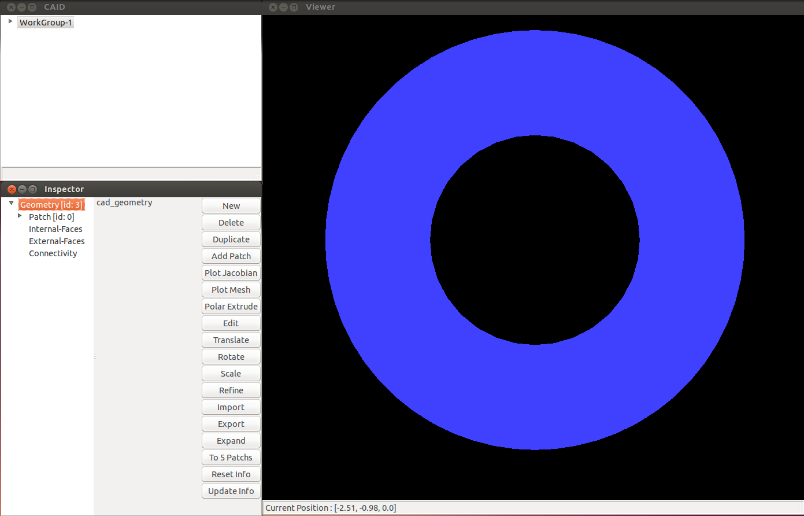

   Patch actions: Patch before splitting.

The final result is giving in (Fig patch_actions_fig_splitb_)

.. _patch_actions_fig_splitb:

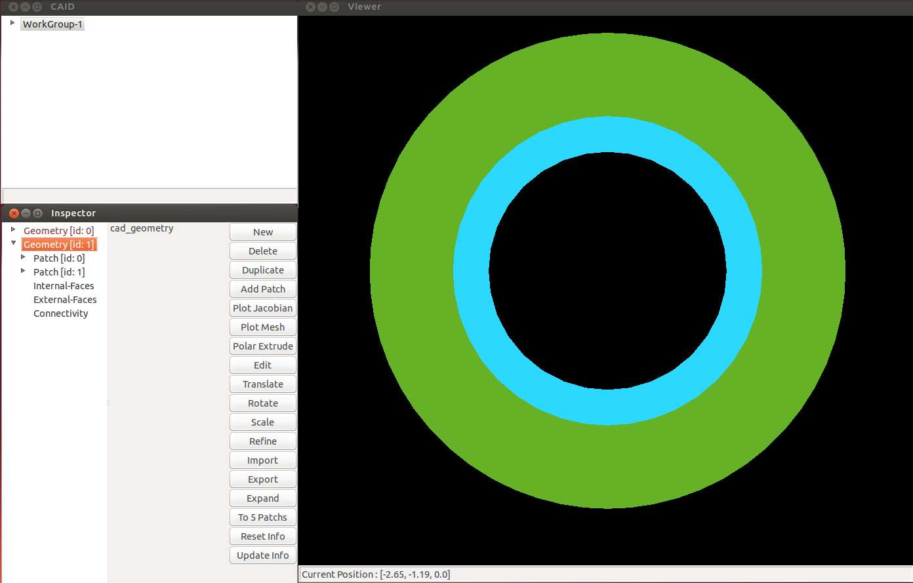

   Patch actions: The resulting patchs after splitting the original patch in the *axis* 0 with respect to the knot *0.3*.

.. raw:: latex

   \newpage % hard pagebreak at exactly this position

Stick-C1
********

.. todo:: add an example

Swap
****

Interchange two parametric axes of the current *patch*. This action can only be used in **3D**. As in **2D**, we can use the *transpose* action.

Sweep
*****

Construct the translational sweep of a section curve/surface along a trajectory curve.

If :math:`C,T` are curves then the resulting surface :math:`S` is 

.. math::

  S(u,v) = C(u) + T(v)

If :math:`T` is a curve and :math:`S` is a surface then the resulting volume :math:`V` is 

.. math::

   V(u,v,w) = S(u,v) + T(w)

.. _patch_actions_fig_sweepa:

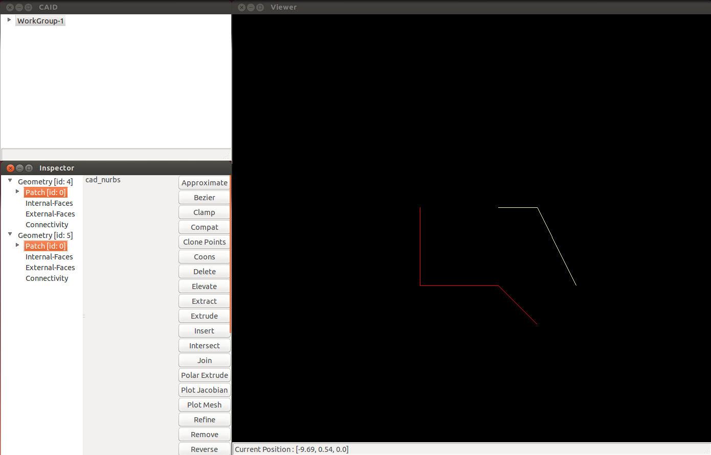

   Patch actions: 2 curves before sweeping.

The final result is giving in (Fig patch_actions_fig_sweepb_)

.. _patch_actions_fig_sweepb:

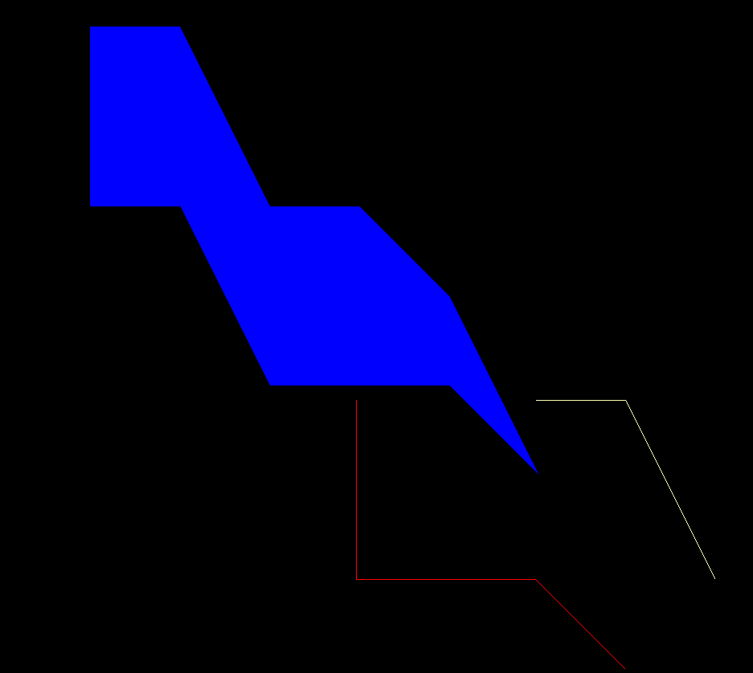

   Patch actions: The resulting patch after sweeping the 2 curves.

.. raw:: latex

   \newpage % hard pagebreak at exactly this position

T-Coons
*******

Creates a **2D** *patch* given 3 curves (boundaries) using the *T-Coons* algorithm. (Fig patch_actions_fig_tcoonsa_)

.. _patch_actions_fig_tcoonsa:

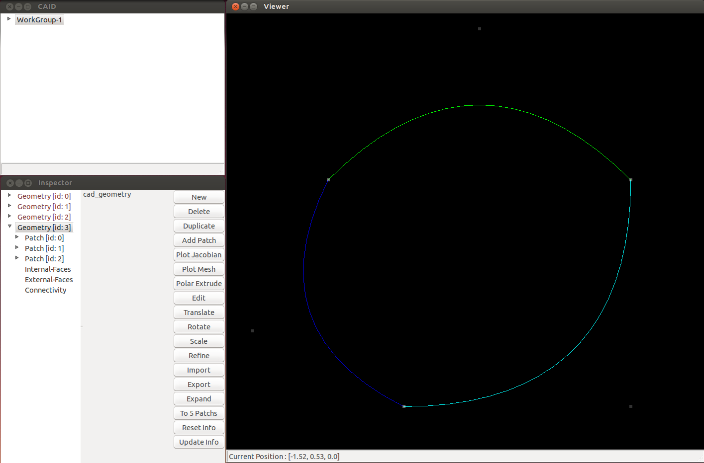

   Patch actions: 3 curves describing the boundary of the 2D domain before applying the T-coons algorithm.

.. note:: In order to apply the coons algorithm, you need to do a multiple selection of the boundaries by maintining **CTRL** while selecting the curves. Note that the actual version does not know the selection order which is very important as it follows the parametric faces numbering. An actual solution is to create a new empty *geometry*, and then copy the boundaries in the correct order. 

.. _patch_actions_figtcoonsb:
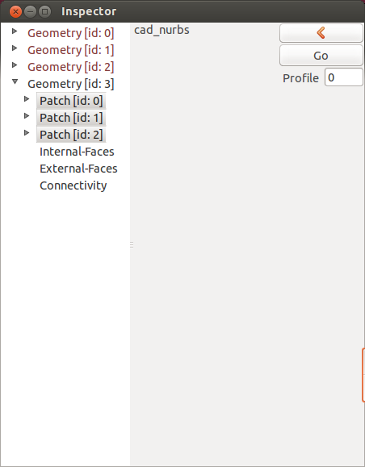

   Inspector - patch actions: T-Coons Interface.

The final result is giving in (Fig patch_actions_fig_tcoonsc_)

.. _patch_actions_fig_tcoonsc:

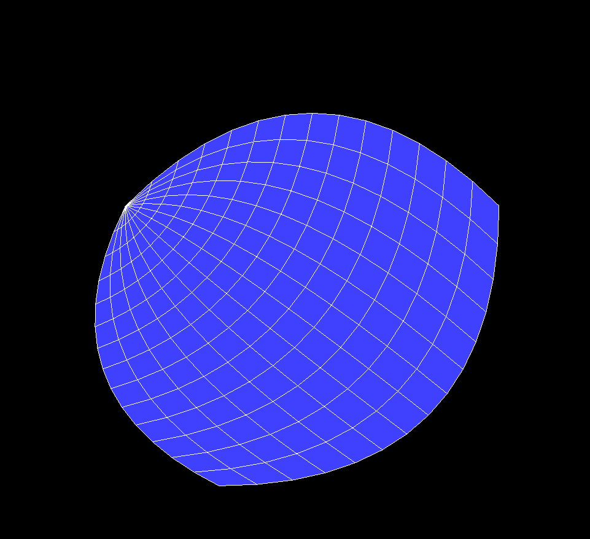

   Patch actions: The resulting patch after applying the T-coons algorithm with the profible 0.

.. todo:: The T-coons algorithm with profiles 1,2 and 3 are not yet available.   

.. raw:: latex

   \newpage % hard pagebreak at exactly this position

Translate
*********

Translates the current *patch* with the specified displacement.

Transpose
*********

Permutes parametric axes of the current *patch*, with the given ordering and adjust the control points accordingly.

Unclamp
*******

Transforms the open knot vector of the selected *patch* to use *uniform B-splines*. The user can specify the *axis* and the *side* of the knot vector.

.. note:: see the Clamp action, for the inverse operation.

.. _patch_actions_fig_unclampa:

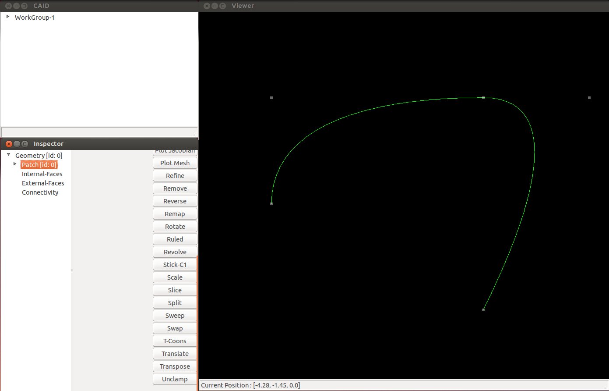

   Patch actions: Patch and its Control Points, before the Unclamp action.

The final result is giving in (Fig :ref:`patch_actions_fig_unclampb`)

.. _patch_actions_fig_unclampb:

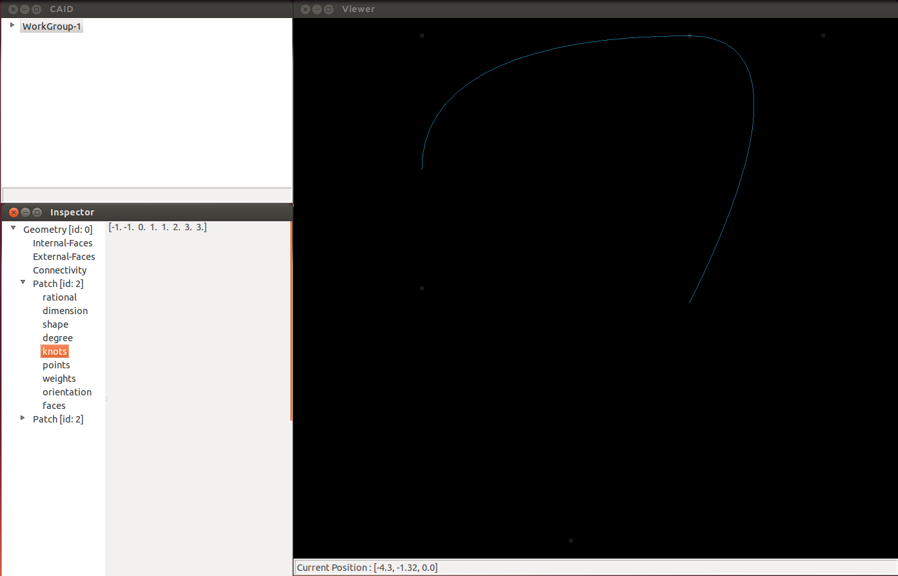

   Patch actions: The resulting patch after unclamping the patch in the two direction and both sides.

.. _patch_actions_fig_unclampc:
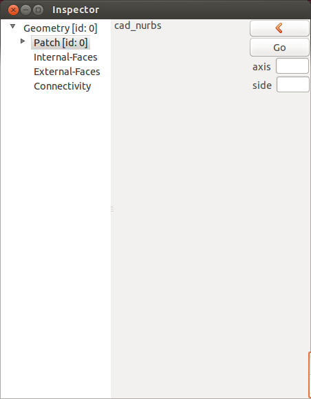

   Patch actions: The Unclamp action interface.

.. raw:: latex

   \newpage % hard pagebreak at exactly this position

Direct Actions
**************

.. todo:: a rajouter

Right click Actions
*******************

* **Show** 
  
  shows the current *patch*

* **Hide** 
  
  hides the current *patch* 

* **Show Mesh** 
  
  shows the mesh of the current *patch* 

* **Hide Mesh** 
  
  hides the mesh of the current *patch* 

* **Show Control Points** 
  
  shows the control points of the current *patch* 

* **Hide Control Points** 
  
  hides the control points of the current *patch* 

* **Edit Control Points** 
  
  edits the control points of the current *patch* 

* **Copy** 
  
  copies the current *patch* into the clipboard, in order to be *paste* later 

* **Rename** 
  
  renames the current *patch*. Also can be done by pressing **F2**

* **Color** 
  
  sets the local *color* for the current *patch*. If the local color is not specified, **CAID** will inherit it from the *geometry*.

* **Mesh steps** 
  
  sets the local *mesh steps* for the current *patch*. If the local *mesh steps* is not specified, **CAID** will inherit it from the *geometry*.

* **Properties** 
  
  shows some *properties* of the current *patch*

.. Local Variables:
.. mode: rst
.. End:
