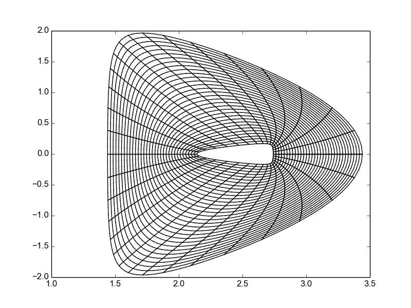
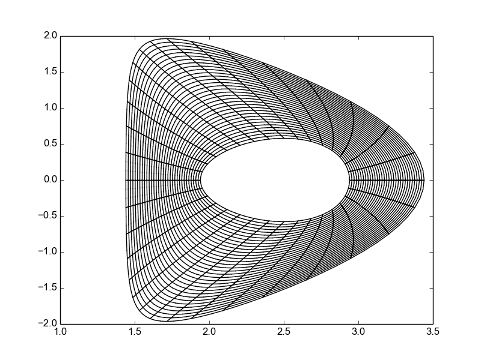
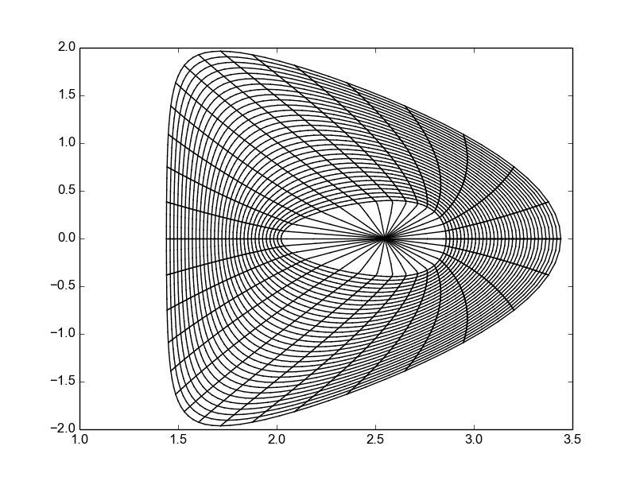
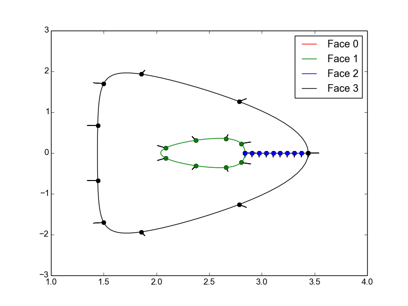
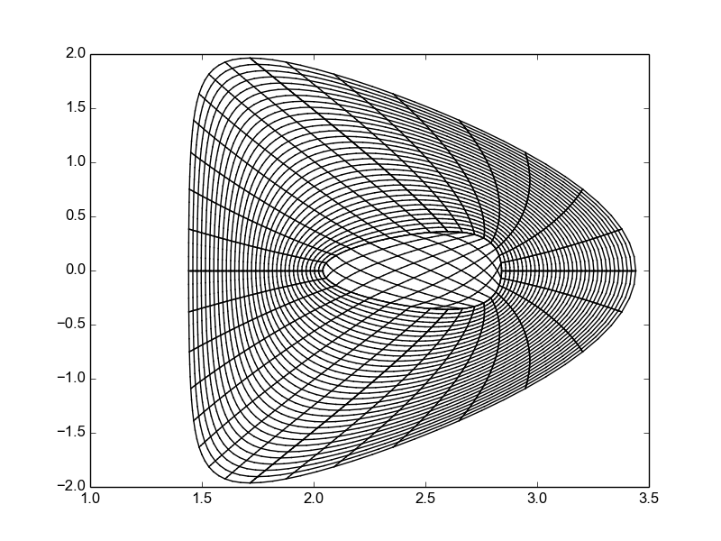

.. role:: envvar(literal)
.. role:: command(literal)
.. role:: file(literal)
.. role:: ref(title-reference)
.. _gallery:

Plasma Equlibirum
*****************

MHD Equilibirum
^^^^^^^^^^^^^^^

.. todo:: add grad-shafranov and soloviev solutions

Local Equilibrium
^^^^^^^^^^^^^^^^^

D-Shaped -- Miller
__________________

We consider a :math:`2D` local equilibrium as described by Miller. The change of coordinate is given in polar coordinates, by:

.. math::

  R(r, \theta) &= R_0(r) + r \cos(\theta + \sinh(\delta) \sin(\theta)) 
  \\
  Z(r,\theta) &= \kappa(r) r \sin(\theta)

.. todo:: add citation Miller

where

.. math::

  R_0 &= A \tilde{\psi}
  \\
  R_0(r) &= ( A - \partial_r R_0 ) \tilde{\psi} + r (\partial_r R_0)
  \\
  \kappa(r) &= \kappa_0 (1 + s_{\kappa} \ln(\frac{r}{\tilde{\psi}}))
  \\
  \delta(r) &= s_{\delta} \sqrt{1- \delta_0^2}\ln(\frac{r}{\tilde{\psi}}) 

Two kind of paramters should be provided

* **shape parameters** are :math:`A, \tilde{\psi}, \kappa_0, \delta_0, \alpha`. The user should specify them as a dictionary

.. literalinclude:: ../../examples/plasma_equilibrium_2d.py
  :lines: 20-25

* **equilibrium parameters** are :math:`s_{\kappa}, s_{\delta}, \partial_r R_0, q, s`. The user should specify them as a dictionary

.. literalinclude:: ../../examples/plasma_equilibrium_2d.py
  :lines: 27-32

Now that both the shape and equilibrium parameters are chosen, the user can create the Miller equilbrium, simply by importing the function **miller_equilibrium** from **caid.cad_geometry**

.. literalinclude:: ../../examples/plasma_equilibrium_2d.py
  :lines: 17-39

The resulting plot is

Default parameters are chosen, if the user does not specify them.

.. literalinclude:: ../../examples/plasma_equilibrium_2d.py
  :lines: 7-13

The resulting plot is

Now the next step is to remove the internal hole. This can be done again in two ways 

* *using a singular mapping*

.. literalinclude:: ../../examples/plasma_equilibrium_2d.py
  :lines: 43-54

The resulting plot is

As we can see, the resulting mapping is not regulat. Additional work must be done: insert new knots and move the control points to ensure the :math:`\mathcal{C}^1` continuity.

.. todo:: regular map

* *using a 5 multipatch approach*

.. literalinclude:: ../../examples/plasma_equilibrium_2d.py
  :lines: 58-72

The resulting plots are

.. Local Variables:
.. mode: rst
.. End:
