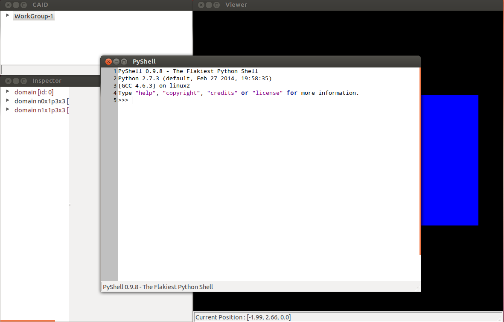
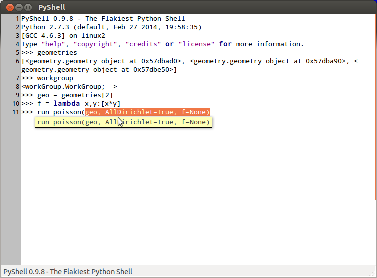

.. role:: envvar(literal)
.. role:: command(literal)
.. role:: file(literal)
.. role:: ref(title-reference)
.. _pyshell:

PyShell
=======

**CAID** offers the possibility of using *command lines* and manipulating *geometries* directly from a *Python Shell*. First select the current *workgroup* and then click on *Start Command Line* in the *Tools* menu (or press keyboard shortcut **F9**). The *Python Shell* window appears, which look likes (Fig. )

.. _pyshell:

   The internal Python Shell.

In the current example, in order to access to the list of *geometries* of the current workgroup, type::

   >>> geometries
   [<geometry.geometry object at 0x497cad0>, <geometry.geometry object at 0x497ca90>, <geometry.geometry object at 0x497ce50>]

While the *workgroup* can be accessed via::

   >>> workgroup

You can for example, run a poisson solver on a given geometry::

   >>> geo = geometries[2]
   >>> f = lambda x,y:[x*y]
   >>> run_poisson(geo, AllDirichlet=True, f=f)

as shown in figure (Fig. pyshell_run_poisson_)   

.. _pyshell_run_poisson:

   Runing the Poisson solver on a given geometry.

.. note:: This work is under progress. In the future, the user will be able to access the *geometry* by given its name. We will add other solvers too.   

Access Inspector Data
*********************

When a **workgroup** is selected in the **workgroup tree inspector**, it can be accessed using::

   >>> wk = workgroup

A **geometry** object can be accessed by given its **id** using::

   >>> geo = geometries[0]

.. todo:: access geometry by name   

Make your own plugin visible inside PyShell
*******************************************

You can make your own **plugin** visible inside PyShell by adding it::

   gvim $CAID_SRC/PyShell.py

and adding your **import** and modifying the **setVisibleVariables** function::

    >>> def setVisibleVariables(self):
    >>>     wk = self.parent.tree.currentWorkGroup
    >>>     # ... workgroup
    >>>     __main__.__dict__["workgroup"]  = wk
    >>>     # ... geometry elements
    >>>      __main__.__dict__["geometries"]  = wk.list_geo   

.. Local Variables:
.. mode: rst
.. End:
