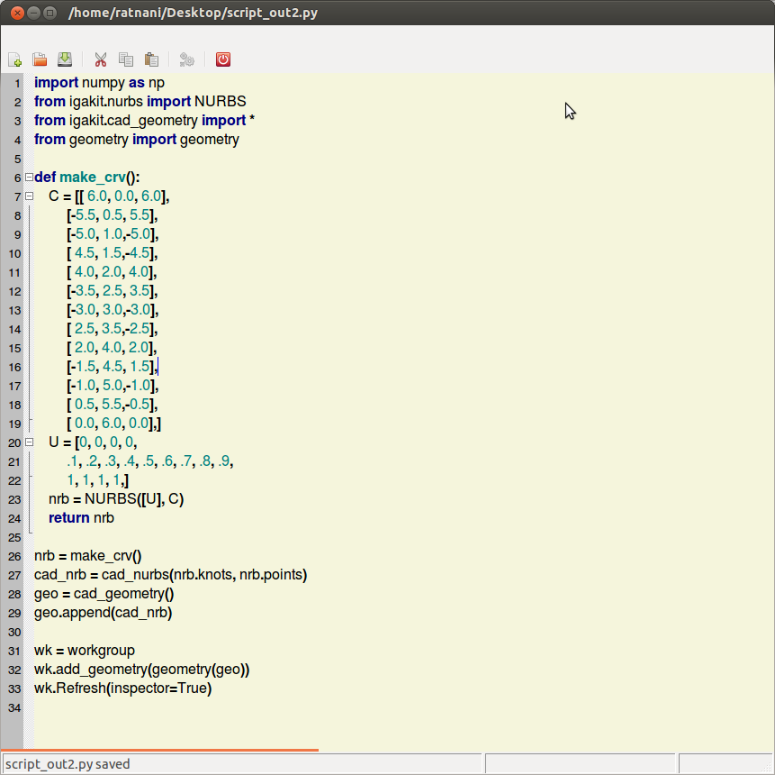
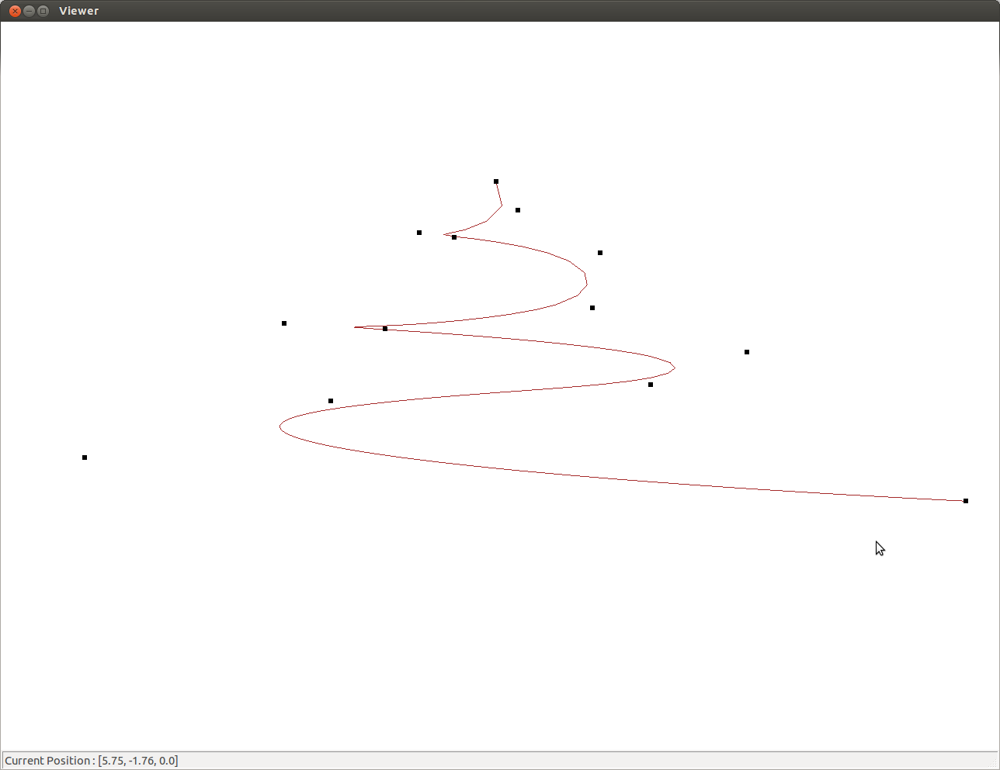

.. role:: envvar(literal)
.. role:: command(literal)
.. role:: file(literal)
.. role:: ref(title-reference)
.. _pythoneditor:

Python Editor
=============

**CAID** embeeds a Python Editor. You can interact with **CAID** via the editor by *executing* your own Python commands.

To open the Python Editor, press **Python Editor** in **Tools** menu, or press **F3** if the current *workgroup* is selected in the *workgroup inspector tree*.

Edit script using the Python Editor
***********************************

You can open and edit your *macro* or *script* by pressing **Python Editor** in **Tools** menu or **F3** if the current *workgroup* is selected in the *workgroup inspector tree*.

Execute a script 
****************

In order to *execute* your *macro* or *script* press on the *execute* button in the Python Editor.

Example
*******

The following example shows how to create a nem *geometry* object and add it into the *workgroup*. Let us consider the following python script::

    import numpy as np
    from igakit.nurbs import NURBS
    from igakit.cad_geometry import *
    from geometry import geometry

    def make_crv():
        C = [[ 6.0, 0.0, 6.0],
             [-5.5, 0.5, 5.5],
             [-5.0, 1.0,-5.0],
             [ 4.5, 1.5,-4.5],
             [ 4.0, 2.0, 4.0],
             [-3.5, 2.5, 3.5],
             [-3.0, 3.0,-3.0],
             [ 2.5, 3.5,-2.5],
             [ 2.0, 4.0, 2.0],
             [-1.5, 4.5, 1.5],
             [-1.0, 5.0,-1.0],
             [ 0.5, 5.5,-0.5],
             [ 0.0, 6.0, 0.0],]
        U = [0, 0, 0, 0,
             .1, .2, .3, .4, .5, .6, .7, .8, .9,
             1, 1, 1, 1,]
        nrb = NURBS([U], C)
        return nrb

    nrb = make_crv()
    cad_nrb = cad_nurbs(nrb.knots, nrb.points)
    geo = cad_geometry()
    geo.append(cad_nrb)

    wk = workgroup
    wk.add_geometry(geometry(geo))
    wk.Refresh(inspector=True)

save and store it somewhere, and then run **CAID**. Press **F3** and open it in the Python Editor.    

.. _pythoneditor_example_curve_figa:

   The Python Editor using the previous script.

press *execute*, you'll see the following curve in the *viewer*

.. _pythoneditor_example_curve_viewer_figa:

   The result of the previous script.

.. Local Variables:
.. mode: rst
.. End:
