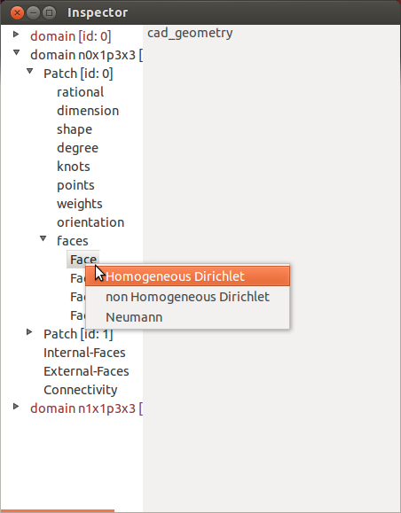
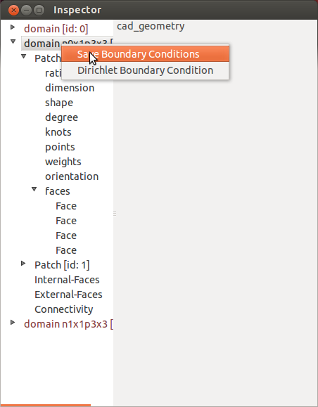
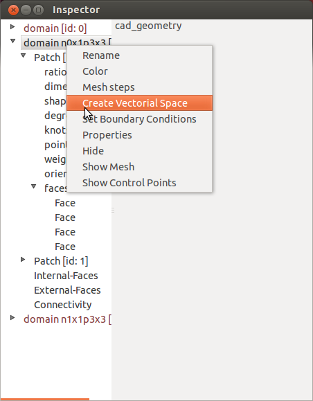
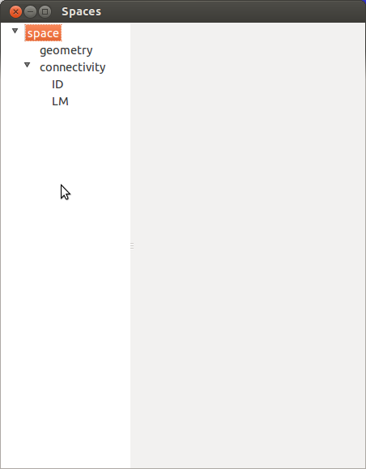
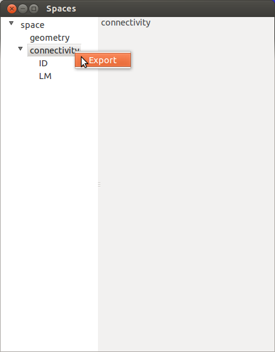

.. role:: envvar(literal)
.. role:: command(literal)
.. role:: file(literal)
.. role:: ref(title-reference)
.. _spaces:

Vectorial Spaces
================

In this section, we show how to construct a discrete vectorial space for a given *geometry* after scpecifying the boundary conditions.

Define Boundary Conditions
**************************

1- In the *geometry* inspector window, select the *geometry* that you want to use.

2- Press the Mouse Right-button and click on *Set Boundary Conditions*

3- Navigate through the *geometry* in the inspector, and choose a boundary condition for each *face* of interest. This is done by a Right-button mouse click as shown in (Fig. inspector_spaces_set_boundary_condition_).

.. _inspector_spaces_set_boundary_condition:

   Choose a boundary condition on a specific face

4- If you want to have Dirichlet boundary condition on the whole domain, skip the last point and right-click on the *geometry*. Then choose *Dirichlet Boundary Condition* (see Fig. inspector_spaces_set_boundary_condition_final_)

5- When you have finished the last remaining step is to save these *bondary conditions* as shown in (Fig. inspector_spaces_set_boundary_condition_final_)

.. _inspector_spaces_set_boundary_condition_final:

   Choose Dirichlet boundary conditions or save them.

6- Finally, create the vectorial space with a right-click on the *geometry* as shown in (Fig. inspector_spaces_create_vectorial_space_)

.. _inspector_spaces_create_vectorial_space:

   Create the vectorial space after specifying the boundary conditions.

A new window appears which contains a *space inspector* (see Fig. inspector_spaces_). As you can see, you have access to the *geometry* and a new object: the *connectivity*.

.. _inspector_spaces:

   The space inspector.

   
Vectorial space connectivity
****************************

The connectivity is defined using two arrays:

* **ID** which maps the global *id* of a basis function with its position in the discrete matrix.

* **LM** given a patch and an element tuple (or an element global index), this array maps the local index of the basis function to its *id* in **ID**

The user can export these arrays by a right-click on the connectivity and then press *Export*, as shown in (Fig. inspector_spaces_connectivity_export)

.. _inspector_spaces_connectivity_export:

   Export the connectivity (ID and LM arrays) of the current vectorial space.

.. Local Variables:
.. mode: rst
.. End:
