.. role:: option(literal)
.. role:: file(literal)
.. _TUTORIAL:

Tutorial
========

**Objective:** At the end of this tutorial you will understand how to
run, manipulate and mesh 2D objects.

You can launch **CAID** by running ::

  caid

or giving the **wkl** session file ::
  
  caid mysession.wkl

or adding the **xml** geometry file ::
  
  caid mygeometry.xml

or giving the **pfl** field file, only for visualization ::
  
  caid myfield.pfl

**CAID** is based on some fundomental windows that are:

**workgroup**

**Inspector**

**Viewer**

**fields**

**spaces**

When you run **CAID** without any argument, you can only see the **workgroup** window. You can then create a new workgroup, or open a stored one. 

* Run **CAID** without any argument (Fig caid_fig0_).

.. _caid_fig0:
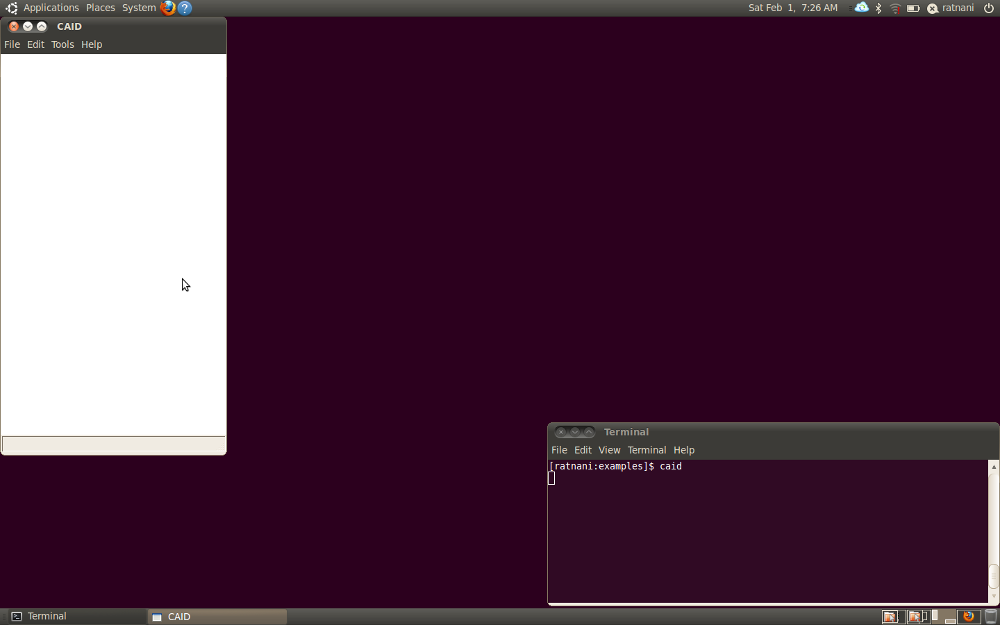

* Create a new Project (Workgroup) (Fig caid_fig1_).

  In the **File** menu, click on **new**

.. _caid_fig1:
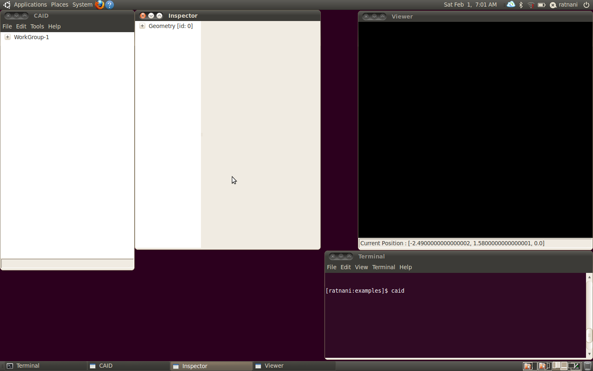

* An empty geometry object is already created. When you select a *geometry* object, you can see the corresponding list of buttons, in the *Inspector* (Fig caid_fig2_)

.. _caid_fig2:
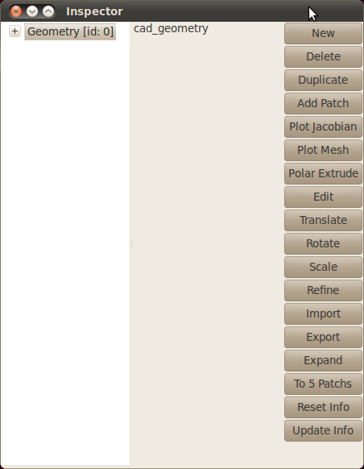

* **CAID** offers some predefined geometries (Fig caid_fig3_)

.. _caid_fig3:
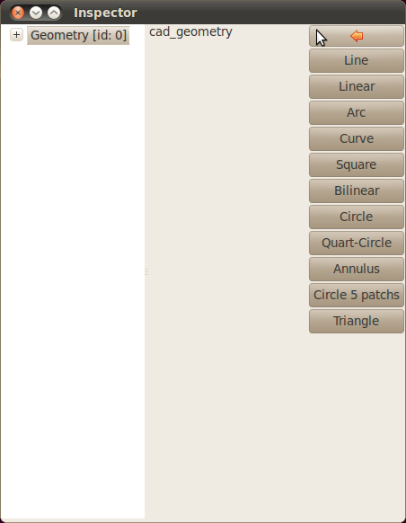

* Click on the *circle* button. This will create a circle domain, using one single patch. You need to specify its radius (Fig caid_fig4_)

.. _caid_fig4:
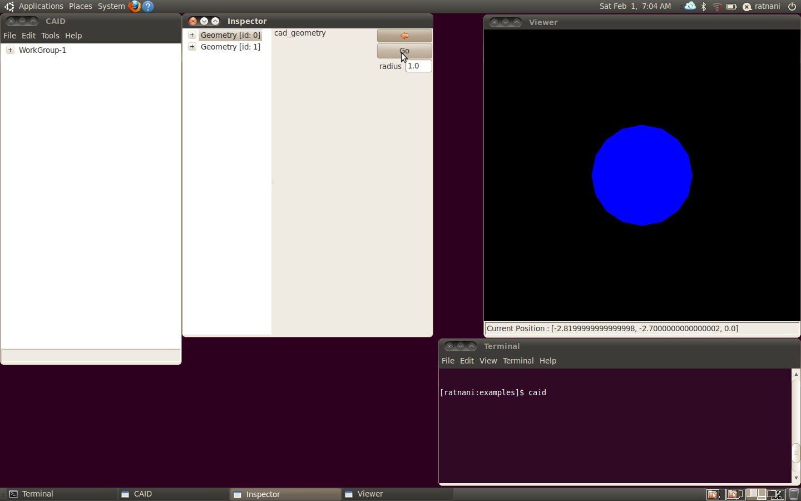

* When you select a *patch* object, you can see the corresponding list of buttons, in the *Inspector* (Fig caid_fig5_)

.. _caid_fig5:
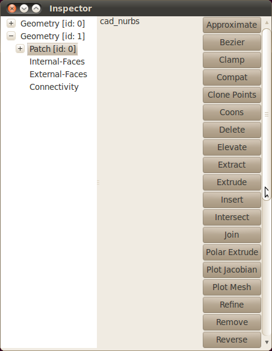

* By expanding a *patch* object, you can see its attributs in the *Inspector* (Fig caid_fig6_). These attributs are:

  * **rational** if the patch is a rational B-spline (NURBS)

  * **dimension** this is the parametric dimension: 1 for curves, 2 for surfaces and 3 for volumes

  * **shape** number of control points in each parametric direction 

  * **degree** B-splines degrees for each direction 

  * **points** Control Points 

  * **weights** weights of the NURBS. Default value for B-splines patchs is an array of ones 

  * **orientation** this is the orientation of the outward normal vectors to the patch boundary, given for each face of the parametric domain. 

  * **faces** The faces of a patch are viewed as geometries objects. This is very useful when we want to specify boundary conditions. A face object can be extracted by clicking on the right mouse button.

.. _caid_fig6:
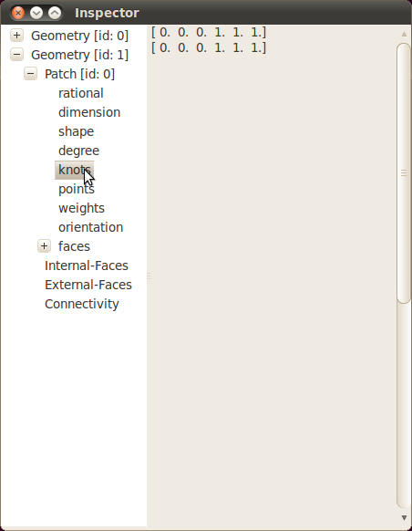

Another useful description of the circle, is given with 5 patchs. Select any *geometry* object to get access to geometries actions. Then click on the *new* button, and the *circle5mp* button. (Fig caid_fig7_)

.. _caid_fig7:
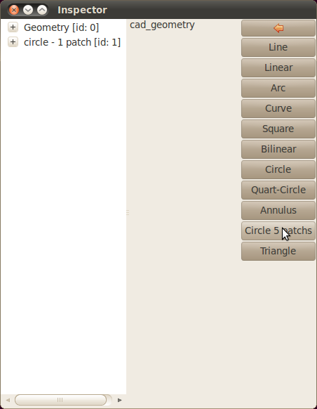

The corresponding object is shown in (Fig caid_fig8_)

.. _caid_fig8:
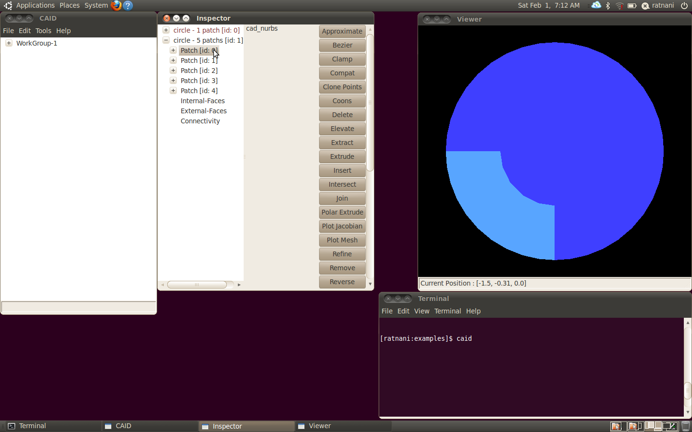

By expanding the *geometry* object, you get access to the external faces (Fig caid_fig8a_)

.. _caid_fig8:
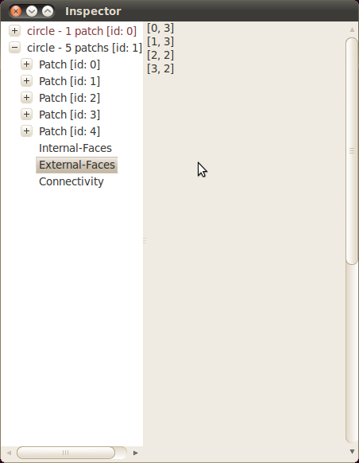

the internal faces (Fig caid_fig8b_)

.. _caid_fig8:
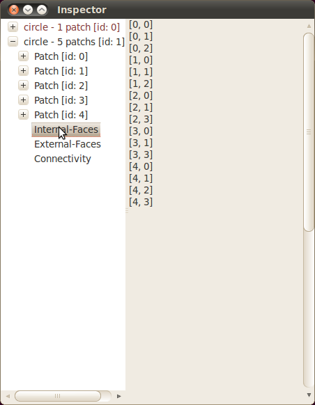

and the inter-patch connectivity (Fig caid_fig8c_)

.. _caid_fig8:
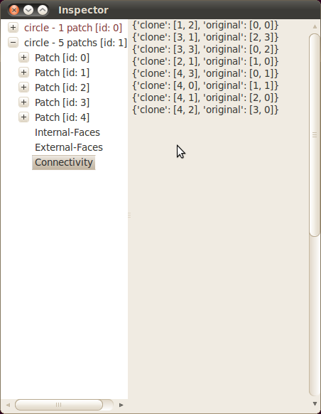

When selecting a patch from a geometry* object, it is automatically highlighted. You can also specify a color for each patch, by selecting it and right click.(Fig caid_fig9_)

.. _caid_fig9:
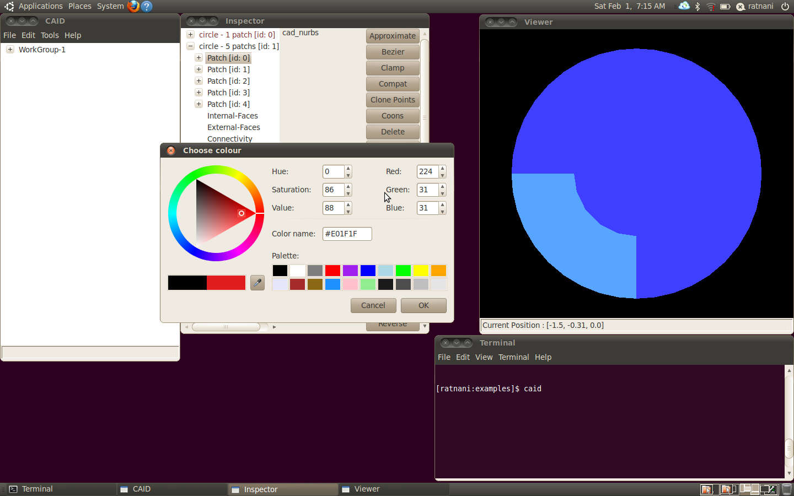

After selecting colors, we get the final plot (Fig caid_fig10_)

.. _caid_fig10:
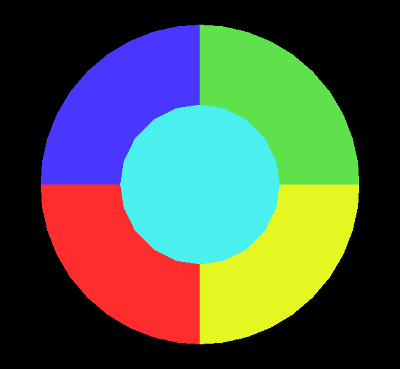

* Editing a Control Point, can be done by selecting a patch, right-click on *edit control points*. A new window is opend that lists all control points and their weights. When selecting a control point, it is automatically highlighted in the Viewer (Fig caid_fig11a_)

.. _caid_fig11a:
.. figure::     images/circle5mp_editpoints.png
   :align:      center

Select the control point of interest, and right-click on *edit*. A new window opens, and you need to set the new values for the selected control point (Fig caid_fig11b_)

.. _caid_fig11b:
.. figure::     images/Edit_Point.png
   :align:      center
   :width: 6cm
   :height: 2.5cm

After modification, the new geometry is (Fig caid_fig11c_)

.. _caid_fig11c:
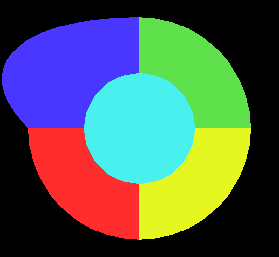

.. Local Variables:
.. mode: rst
.. End:
