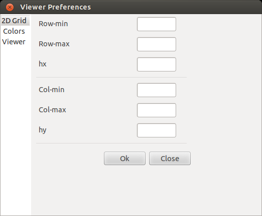
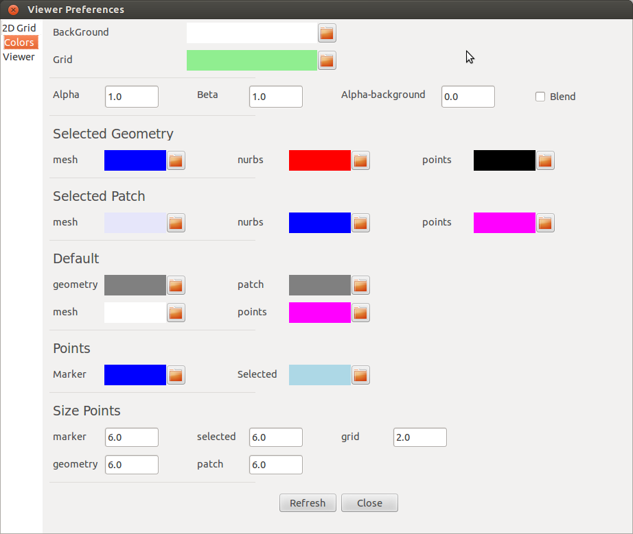
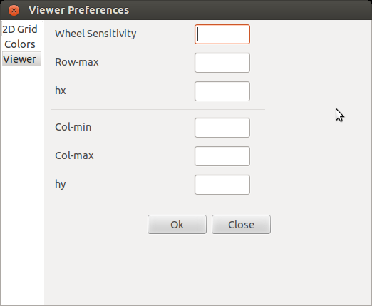

.. role:: option(literal)
.. role:: file(literal)
.. _viewer:

Viewer
======

Viewer Menu
***********

Zoom In/Out
^^^^^^^^^^^

Can be done by moving the mouse wheel or its equivalent on laptop.

Camera Position
^^^^^^^^^^^^^^^

To change the camera position maintain the left button pressed while mouving the mouse.

.. _viewer_preferences_label:

Viewer Preferences
******************

Shows the *Viewer Preferences* window which is a notebook containing the following pages 
  
  
1- The grid page (Fig. viewer_actions_fig_preferences_grid_).

.. _viewer_actions_fig_preferences_grid:

   Viewer Preferences: The grid page.

2- The colors page (Fig. viewer_actions_fig_preferences_colors_).

.. _viewer_actions_fig_preferences_colors:

   Viewer Preferences: The colors page.

3- The viewer page (Fig. viewer_actions_fig_preferences_viewer_).

.. _viewer_actions_fig_preferences_viewer:

   Viewer Preferences: The viewer page.

Direct Actions
**************

.. todo:: a rajouter

Right click Actions
*******************

* **2D view**

  Puts and fixes the camera perpendicular to the *2D* plan

* **3D view**

  Unclampes the camera in order to have a *3D* view  

* **Show Grid** 

  Shows the grid (needs a *2D view*)

* **Hide Grid**

  Hides the grid

* **Grid as Points**

  Sets the grid as points rather than lines

* **Grid as Lines**

  Sets the grid as lines

* **Clear Markers**

  Clears the Marker list points

* **Clear Selected Points**

  Clears the Selected list points

* **Fixed Markers**

  Uses the nearest point to the grid when selecting it from the *viewer*

* **Floating Markers**

  Uses a Floating Marker (the opposite of *Fixed Markers* action)

* **Add Marker**

  Edits and adds a new *Marker*

* **Import Markers**

  Imports *Markers* from a given file

* **Export Markers**

  Exports and save the *Markers* points list

* **Print**

  Prints the current *viewer*

* **Preferences**

  See :ref:`viewer_preferences_label` for more details.

.. Local Variables:
.. mode: rst
.. End:
